# Technical Architecture Specification
## AI-Based Personalized Career Guidance for Students ("Career Decision & Pathway Companion")
**Document Version:** 1.0.0  
**PRD Reference:** Refined PRD v2.0 (19 August 2026)  
**Status:** Implementation-Ready Architecture Specification  
**Classification:** Proprietary / Engineering Blueprint  

---

## Table of Contents
1. [Architecture Executive Summary](#1-architecture-executive-summary)
2. [PRD Understanding & Scope Boundaries](#2-prd-understanding--scope-boundaries)
3. [Architecture Goals](#3-architecture-goals)
4. [Architecture Principles](#4-architecture-principles)
5. [Assumptions](#5-assumptions)
6. [Constraints](#6-constraints)
7. [Architecture Decision Summary](#7-architecture-decision-summary)
8. [System Context](#8-system-context)
9. [High-Level Architecture](#9-high-level-architecture)
10. [Domain-Driven Design & Bounded Contexts](#10-domain-driven-design--bounded-contexts)
11. [Backend Architecture](#11-backend-architecture)
12. [Frontend Architecture](#12-frontend-architecture)
13. [Data Architecture](#13-data-architecture)
14. [Deterministic Recommendation Engine Architecture](#14-deterministic-recommendation-engine-architecture)
15. [AI / RAG Architecture](#15-ai--rag-architecture)
16. [Counselor Operations Architecture](#16-counselor-operations-architecture)
17. [CMS & Knowledge Management Architecture](#17-cms--knowledge-management-architecture)
18. [Authentication, Authorization & Multi-Tenancy](#18-authentication-authorization--multi-tenancy)
19. [Consent Architecture & Minor Protection](#19-consent-architecture--minor-protection)
20. [Security Architecture & Threat Defense](#20-security-architecture--threat-defense)
21. [Privacy & Data Lifecycle Management](#21-privacy--data-lifecycle-management)
22. [Offline & Low-Bandwidth Architecture](#22-offline--low-bandwidth-architecture)
23. [API Architecture & Gateway Design](#23-api-architecture--gateway-design)
24. [Event-Driven Architecture & Message Bus](#24-event-driven-architecture--message-bus)
25. [Background Jobs & Asynchronous Workers](#25-background-jobs--asynchronous-workers)
26. [Notification Subsystem](#26-notification-subsystem)
27. [Product Analytics & Telemetry](#27-product-analytics--telemetry)
28. [Observability, SRE & Audit Subsystem](#28-observability-sre--audit-subsystem)
29. [Infrastructure & Cloud Architecture](#29-infrastructure--cloud-architecture)
30. [Deployment Architecture](#30-deployment-architecture)
31. [CI/CD Pipeline Architecture](#31-cicd-pipeline-architecture)
32. [Disaster Recovery & Business Continuity](#32-disaster-recovery--business-continuity)
33. [Scalability Strategy](#33-scalability-strategy)
34. [Performance Optimization](#34-performance-optimization)
35. [Cost Architecture & Token Budgeting](#35-cost-architecture--token-budgeting)
36. [Test Architecture & Quality Assurance](#36-test-architecture--quality-assurance)
37. [AI Evaluation & Groundedness Benchmarks](#37-ai-evaluation--groundedness-benchmarks)
38. [Recommendation Engine Evaluation & Fairness](#38-recommendation-engine-evaluation--fairness)
39. [Repository & Codebase Monorepo Structure](#39-repository--codebase-monorepo-structure)
40. [Comprehensive Relational Data Model (DDL Specifications)](#40-comprehensive-relational-data-model-ddl-specifications)
41. [API Contracts (OpenAPI 3.1 JSON Schemas)](#41-api-contracts-openapi-31-json-schemas)
42. [System State Machines](#42-system-state-machines)
43. [Mermaid Sequence & Architectural Diagrams](#43-mermaid-sequence--architectural-diagrams)
44. [Architecture Decision Records (ADR-001 to ADR-012)](#44-architecture-decision-records-adr-001-to-adr-012)
45. [PRD Traceability Matrix](#45-prd-traceability-matrix)
46. [Failure Mode Analysis (FMA)](#46-failure-mode-analysis-fma)
47. [STRIDE Security Threat Model](#47-stride-security-threat-model)
48. [Engineering Risks & Mitigation Strategies](#48-engineering-risks--mitigation-strategies)
49. [Open Architecture Decisions & PRD Gaps](#49-open-architecture-decisions--prd-gaps)
50. [Implementation Roadmap & Phasing](#50-implementation-roadmap--phasing)
51. [Architecture Definition of Done (DoD)](#51-architecture-definition-of-done-dod)
52. [Final Architecture Self-Review](#52-final-architecture-self-review)

---

## 1. Architecture Executive Summary

The **AI-Based Personalized Career Guidance System** is architected as a **Career Decision and Pathway Companion** designed specifically for Indian school students (Classes 8–12) and early-college students navigating critical academic and vocational transitions. 

This architecture directly addresses the five core systemic gaps identified in the PRD:
1. **Self-Knowledge Gap:** Resolved via stage-aware, multi-factor psychometric and interest exploration without marks-based destiny prediction.
2. **Career-Awareness Gap:** Resolved via a verified, localized Indian career knowledge graph with occupational realities and entry pathways.
3. **Feasibility Gap:** Resolved via multi-constraint scoring (budget, location, eligibility, time, accessibility) separating personal fit from practical viability.
4. **Market Gap:** Resolved via dated, localized market indicators with mandatory source attribution and uncertainty disclosures.
5. **Action Gap:** Resolved via adaptive 7/30/90/180-day roadmaps tied to verifiable skill milestones, free-first learning resources, and fallback paths.

### Core Architectural Stance
* **Modular Monolith First:** For MVP and pilot scale (up to 500k active students), the system is deployed as a modular monolith in TypeScript/Node.js or Python FastAPI with asynchronous worker queues and an internal event bus, avoiding the premature operational overhead of microservices while enforcing strict bounded context boundaries.
* **Deterministic Recommendation Engine:** Core career recommendations are calculated using a transparent, multi-stage mathematical filtering and scoring engine. **Large Language Models (LLMs) NEVER make unsupervised career selections or score assignments.**
* **Source-Grounded RAG AI Assistant:** The AI conversational layer operates exclusively within a strict Retrieval-Augmented Generation (RAG) sandbox querying verified, published CMS content with mandatory citations. If evidence is missing, the assistant refuses to hallucinate and states: *"I don't have verified current information for this."*
* **Human-in-the-Loop Escalation:** Psychological distress, high-stakes decision paralysis, contradictory signals, and low-evidence profiles trigger automated routing to trained human career counselors.

---

## 2. PRD Understanding & Scope Boundaries

### 2.1 Product Philosophy & Anti-Patterns
| What the System IS | What the System IS NOT (Anti-Goals) |
|---|---|
| A guided decision-support companion offering 3–5 viable pathways | NOT a deterministic career predictor claiming 99% accuracy |
| An explainable scoring engine evaluating Fit, Feasibility, & Evidence | NOT a black-box AI model or unconstrained chatbot |
| An action-oriented 30/90/180-day milestone tracker | NOT an affiliate-driven course marketplace or college lead-gen portal |
| A constraint-aware navigator prioritizing low-cost & public routes | NOT a marks-only aptitude filter that shames or limits students |
| A triage and support tool augmenting human counselors | NOT an autonomous high-stakes decision maker or replacement for counselors |
| A privacy-first platform with guardian consent for minors | NOT a mental health diagnostic or therapeutic tool |

### 2.2 Scope Boundaries
* **In Scope (P0 MVP):** Stage-aware onboarding (Classes 8–10, 11–12, Early College); Guardian context collection; Verified career library; Deterministic recommendation generator (3–5 pathways + backup); Fit/Feasibility/Evidence labels; Side-by-side comparison; Adaptive roadmaps (7/30/90/180 days); Skill-gap identification; Free-first resource & scholarship signposting; Counselor escalation queue; Source-grounded RAG assistant; Parent summary generator; Offline-capable assessment PWA; Privacy & minor consent engine.
* **Post-MVP (P1):** Practical skill checks, verified project artifact submissions, counselor analytical dashboard, offline assisted camp mode, localized regional languages (Hindi, Tamil, Marathi, Bengali, Telugu).
* **Explicitly Excluded (P2 / Out of Scope):** Resume generation, mock AI interviews, automated job placement guarantees, mid-career professional switching, psychometric clinical diagnosis.

---

## 3. Architecture Goals

1. **Deterministic Reproducibility:** Every career recommendation must be 100% reproducible given the same profile snapshot, assessment version, algorithm version, and market dataset.
2. **Zero-Hallucination Grounding:** 100% of factual statements, scholarship deadlines, and admission requirements generated by the AI must cite verified CMS sources.
3. **Sub-Second Core Latency:** P95 response time for interactive student flows (recommendations, comparisons, roadmap viewing) must remain `< 350ms` on standard 4G and `< 1.2s` on 2G/3G connections.
4. **Resilient Intermittent Offline Operation:** Full assessment completion and roadmap milestone progress must execute offline and synchronize reliably upon reconnection without data loss.
5. **Multi-Tenant Data Isolation:** Strict physical or row-level tenant isolation between schools, educational NGOs, counselor practices, and student cohorts.
6. **Strict Minor Data Protection:** Compliance with India's Digital Personal Data Protection (DPDP) Act 2023, COPPA/FERPA baseline guidelines, verifiable parental consent, and cryptographic right-to-be-forgotten erasure.

---

## 4. Architecture Principles

1. **Security by Design:** Zero-trust architecture; defense-in-depth across client, API, network, database, and background processing.
2. **Privacy by Design:** Strict data minimization; separate collection of student vs. guardian data; explicit purpose-bound consent.
3. **Least Privilege:** Granular role-based (RBAC) and attribute-based (ABAC) access control across all 9 actor personas.
4. **Domain-Driven Modularity:** Strict encapsulation of bounded contexts; inter-module communication only via well-defined domain contracts or domain events.
5. **API-First Design:** OpenAPI 3.1 contracts defined and validated before backend implementation.
6. **Testability:** 100% testable core domain logic isolated from databases, frameworks, and third-party APIs.
7. **Observability:** Comprehensive telemetry (OpenTelemetry traces, Prometheus metrics, structured audit logs) without logging PII.
8. **Explainability:** No opaque scores; all outputs decomposed into Fit Evidence, Feasibility, and Evidence Quality categorical ratings.
9. **Version Everything:** Versioned student profiles, assessment instruments, scoring algorithms, career catalogs, market data, and CMS articles.
10. **Deterministic Business Logic:** Core recommendations computed via pure, deterministic functions.
11. **LLMs as Interface & Synthesis Only:** LLMs never decide career paths, assign numerical scores, or bypass business logic.
12. **Human Escalation:** Automated detection and smooth workflow routing for high-stakes, conflicting, or distress edge cases.
13. **Source-Grounded AI:** RAG pipeline restricted to published, active, non-expired knowledge base documents.
14. **Idempotent APIs:** All state-mutating endpoints enforce idempotency keys to prevent duplicate operations in unstable network conditions.
15. **Fault Tolerance:** Graceful degradation; if the AI service or external market provider fails, the core exploration and roadmap engines remain 100% operational.
16. **Graceful Degradation:** Low-bandwidth mode automatically strips non-essential assets and disables streaming AI chat in favor of cached Q&A.
17. **Backward Compatibility:** Schema evolution via additive changes; semantic versioning across all public and internal APIs.
18. **Universal Accessibility:** WCAG 2.1 Level AA compliance; screen reader compatibility, high-contrast themes, keyboard navigability.
19. **Low-Bandwidth Support:** PWA service workers, binary protocol optimization, image compression, payload budgets `< 150KB` initial load.
20. **Cost-Aware AI Architecture:** Hierarchical model routing, embedding caching, semantic cache for frequent queries, token quotas.
21. **Avoid Premature Microservices:** Modular monolith structure with shared database and isolated schemas.
22. **Clean Separation of Concerns:** Domain layer is free of ORM annotations, HTTP concepts, or external SDKs.
23. **Auditable Decision Trails:** Comprehensive audit logs for every counselor override, assessment submission, and consent revocation.
24. **Zero Commercial Ranking Bias:** Pure algorithmic isolation ensuring sponsored content cannot influence fit or feasibility calculations.

---

## 5. Assumptions

1. **Target Geography & Pilot:** Initial pilot targeting urban and semi-urban CBSE/State Board schools in India (English and Hindi initially, expanding to regional languages in Phase 2).
2. **Device Landscape:** Students predominantly access the system via low-to-mid tier Android smartphones (Android 9+) running Google Chrome or mobile PWAs over 3G/4G cellular networks.
3. **Counselor Ratio:** School partners provide a baseline ratio of 1 counselor per 250 students for escalated reviews; platform provides a shared pool of vetted remote counselors for independent students.
4. **External Public Infrastructure:** National Career Service (NCS) and National Scholarship Portal (NSP) data will be consumed via structured referral links and batch-verified public catalogs rather than real-time synchronous API dependencies.
5. **Age Demographics:** Users range from 13 to 21 years old. Users under 18 require verifiable parental/guardian consent before generating personalized pathway recommendations.

---

## 6. Constraints

1. **Algorithmic Constraint:** No single-career predictions or percentage probabilities of career "success" may be output by any subsystem.
2. **Academic Context Constraint:** Academic marks must never be a mandatory prerequisite for career exploration and must not act as a sole negative filter.
3. **Data Protection & Legal Constraint:** Must adhere to DPDP Act 2023 regulations regarding processing of children's personal data, parental verification, and prohibition of behavioral tracking for targeted advertising.
4. **Latency & Bandwidth Constraint:** Initial page load bundle size `< 200KB` gzipped; all assessment questions cacheable locally for offline completion.
5. **AI Operational Constraint:** Monthly LLM token cost per active student must not exceed `$0.04 USD` (₹3.50 INR) under normal usage.

---

## 7. Architecture Decision Summary

| ID | Decision Area | Chosen Architecture / Technology | Primary Rationale & PRD Traceability |
|---|---|---|---|
| **ADR-001** | System Architecture Style | **Modular Monolith** with Asynchronous Worker Queues | Avoids distributed microservice complexity while enforcing domain boundaries; fits MVP scale perfectly. |
| **ADR-002** | Primary Database | **PostgreSQL 16** with Multi-Schema Bounded Contexts | ACID compliance, JSONB flexibility, relational integrity for assessments, native `pgvector` for RAG. |
| **ADR-003** | In-Memory Cache & Message Broker | **Redis 7.2 (Cluster)** | High-throughput session caching, rate limiting, pub/sub for internal events, and BullMQ worker queue backing. |
| **ADR-004** | AI Orchestration & LLM Strategy | **Hybrid Router** (Llama-3.3-70B / Claude-3.5-Haiku / GPT-4o-Mini via LiteLLM) | Zero-hallucination RAG; strict prompt sandboxing; token cost optimization. |
| **ADR-005** | Recommendation Engine | **Deterministic Multi-Stage Rule & Matrix Pipeline** (TypeScript/Python Core) | 100% reproducible, explainable, bias-auditable; zero LLM dependency for pathway generation. |
| **ADR-006** | Vector Search Engine | **pgvector** (PostgreSQL extension) | Unified operational data store; eliminates multi-database sync overhead for CMS embeddings. |
| **ADR-007** | Frontend Framework | **Next.js 14 (App Router) + React PWA + Vanilla CSS Modules** | SSR/SSG for public career catalog; offline Service Worker caching; compliant with design system tokens. |
| **ADR-008** | Offline Storage & Sync | **IndexedDB via Dexie.js + CRDT-inspired Vector Clock Sync Engine** | Resumable assessments, offline roadmap updates, zero data loss over spotty connections. |
| **ADR-009** | Authentication & Authz | **Self-Hosted Auth with Argon2id + JWT / PASETO + Casbin RBAC/ABAC** | Complete data sovereignty; multi-tenant school isolation; granular minor consent enforcement. |
| **ADR-010** | Event Bus & Background Jobs | **Transactional Outbox + Redis BullMQ** | At-least-once delivery, guaranteed consistency between database transactions and async events. |
| **ADR-011** | Observability Stack | **OpenTelemetry + Prometheus + Grafana + Vector Log Shipper** | End-to-end tracing across AI/DB pipelines; zero PII leakage in telemetry. |
| **ADR-012** | Cloud & Deployment | **Containerized Docker on Managed Kubernetes (EKS/GKE) or Azure AKS** | Infrastructure-as-Code via Terraform; multi-AZ high availability; blue/green deployment. |

---

## 8. System Context

The System Context diagram (C4 Level 1) defines the actors, external dependencies, and boundaries of the Career Decision and Pathway Companion platform.

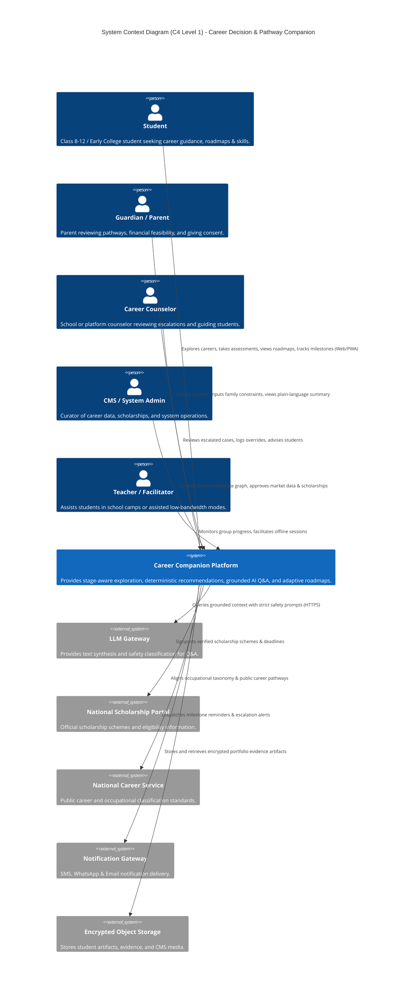

---

## 9. High-Level Architecture

The system is implemented as a **Modular Monolith** with segregated domain packages, an asynchronous job processing cluster, an immutable event bus with transactional outbox, and a multi-tier persistence layer.

```mermaid
graph TB
    subgraph Client_Layer ["Client Layer (Web / PWA)"]
        SW[Service Worker / Cache]
        IDB[(IndexedDB Local Store)]
        UI_Student[Student Portal PWA]
        UI_Guardian[Guardian Review Portal]
        UI_Counselor[Counselor Workspace]
        UI_Admin[CMS & Admin Portal]
        UI_Facilitator[Facilitator Camp Mode]
    end

    subgraph Edge_Layer ["Edge & Ingress Layer"]
        CDN[Global CDN / Edge Cache]
        WAF[Web Application Firewall]
        APIGW[API Gateway / Reverse Proxy & Rate Limiter]
    end

    subgraph Application_Core ["Modular Monolith Application Core"]
        subgraph Domain_Modules ["Bounded Context Modules"]
            MOD_AUTH[Identity & Access Module]
            MOD_STUDENT[Student Profile Module]
            MOD_CONSENT[Consent & Minor Safety Module]
            MOD_ASSESS[Assessment & Scoring Module]
            MOD_CAREER[Career Intelligence Module]
            MOD_REC[Deterministic Recommendation Engine]
            MOD_ROADMAP[Roadmap & Milestone Module]
            MOD_PROGRESS[Skill Progress & Evidence Module]
            MOD_AI[Source-Grounded AI / RAG Module]
            MOD_COUNSEL[Counselor Escalation Module]
            MOD_CMS[Content & Knowledge CMS Module]
            MOD_SCHOLAR[Scholarship & Resource Module]
            MOD_NOTIF[Notification Orchestrator]
            MOD_AUDIT[Audit & Compliance Module]
        end

        EventBus[Internal Event Bus / In-Memory Dispatcher]
        OutboxTable[Transactional Outbox Table]
    end

    subgraph Worker_Cluster ["Asynchronous Worker Cluster (BullMQ)"]
        W_REC[Recommendation Compute Worker]
        W_EMBED[Embedding & Indexing Worker]
        W_DATA[Market & Scholarship Sync Worker]
        W_NOTIF[Notification Dispatch Worker]
        W_MAINT[Reassessment & Expiration Worker]
    end

    subgraph Persistence_Layer ["Persistence & Data Layer"]
        PG_PRIMARY[(PostgreSQL 16 Primary DB)]
        PG_REPLICA[(PostgreSQL Read Replicas)]
        PG_VECTOR[(pgvector Embeddings Index)]
        REDIS_CACHE[(Redis Cluster - Cache & Rate Limiting)]
        REDIS_QUEUE[(Redis BullMQ Queue Store)]
        S3_STORE[(Encrypted S3 / MinIO Object Storage)]
    end

    subgraph External_Services ["External Boundary Services"]
        EXT_LLM[LLM Inference Providers]
        EXT_SMS[SMS / WhatsApp Provider - Gupshup / Twilio]
        EXT_EMAIL[Transactional Email - SendGrid / SES]
    end

    %% Client to Edge
    UI_Student --> CDN
    UI_Guardian --> CDN
    UI_Counselor --> CDN
    UI_Admin --> CDN
    UI_Facilitator --> CDN
    CDN --> WAF
    WAF --> APIGW

    %% Edge to Modules
    APIGW --> MOD_AUTH
    APIGW --> MOD_STUDENT
    APIGW --> MOD_CONSENT
    APIGW --> MOD_ASSESS
    APIGW --> MOD_CAREER
    APIGW --> MOD_REC
    APIGW --> MOD_ROADMAP
    APIGW --> MOD_PROGRESS
    APIGW --> MOD_AI
    APIGW --> MOD_COUNSEL
    APIGW --> MOD_CMS
    APIGW --> MOD_SCHOLAR
    APIGW --> MOD_NOTIF

    %% Module interconnections & persistence
    Domain_Modules --> EventBus
    EventBus --> OutboxTable
    Domain_Modules --> PG_PRIMARY
    Domain_Modules --> REDIS_CACHE
    MOD_AI --> PG_VECTOR
    MOD_PROGRESS --> S3_STORE

    %% Outbox to Workers
    PG_PRIMARY -.-> OutboxTable
    OutboxTable --> REDIS_QUEUE
    REDIS_QUEUE --> Worker_Cluster

    %% Workers to external / persistence
    W_REC --> PG_PRIMARY
    W_EMBED --> PG_VECTOR
    W_DATA --> PG_PRIMARY
    W_NOTIF --> EXT_SMS
    W_NOTIF --> EXT_EMAIL
    MOD_AI --> EXT_LLM
    PG_PRIMARY --> PG_REPLICA
```

---

## 10. Domain-Driven Design & Bounded Contexts

The architecture defines **13 distinct Bounded Contexts**. To prevent tight coupling, domain boundaries are strictly enforced: no module may write directly to another module's database tables. Cross-boundary interactions occur solely via Domain Interfaces (DTOs) or Domain Events.

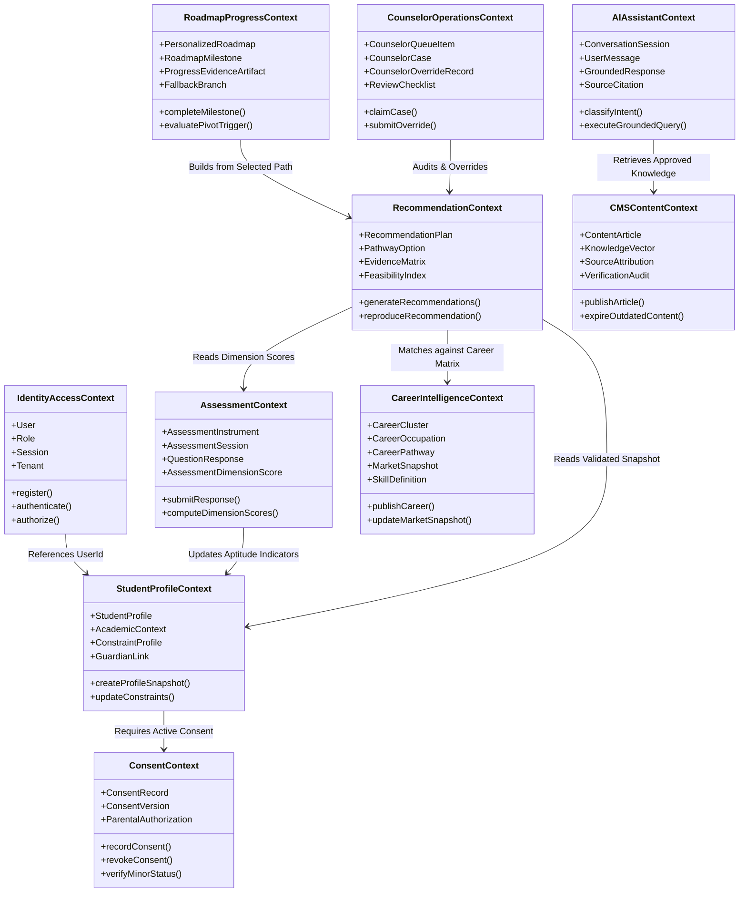

### Bounded Context Directory & Responsibilities
1. **Identity & Access Context (`IdentityAccess`):** Manages user identities, authentication tokens, MFA, PBKDF2/Argon2id password hashing, sessions, tenant schemas, and authorization policies.
2. **Student Profile Context (`StudentProfile`):** Owns student demographic context, education stage (Class 8–10, 11–12, College), geographical constraints, budget ranges, and self-reported interests.
3. **Consent Context (`Consent`):** Tracks verifiable parental consent for minors, consent policy versions, purpose-bound permissions, and revocation logs under the DPDP Act 2023.
4. **Assessment Context (`Assessment`):** Houses psychometric questionnaires, stage-specific instrument versions, response capture, and deterministic dimension scoring.
5. **Career Intelligence Context (`CareerIntelligence`):** Maintains the canonical Indian career knowledge graph, entry pathways, educational requirements, skill taxonomies, and dated local market indicators.
6. **Recommendation Context (`Recommendation`):** Executes pure mathematical, multi-constraint ranking to yield 3–5 pathways with categorical ratings (Fit, Feasibility, Evidence Quality).
7. **Roadmap & Progress Context (`RoadmapProgress`):** Generates 7/30/90/180-day milestone plans, fallback branches, skill-gap checklists, and project evidence tracking.
8. **AI Assistant Context (`AIAssistant`):** Coordinates user conversational sessions, safety filtering, RAG prompt construction, and citation verification.
9. **Counselor Operations Context (`CounselorOperations`):** Manages automated escalation queues, case assignments, SLAs, review checklists, and counselor overrides.
10. **Content & CMS Context (`CMSContent`):** Manages content lifecycle (Draft -> Review -> Published -> Review Due -> Expired), source verifications, and embedding generation.
11. **Scholarships & Resources Context (`ScholarshipsResources`):** Manages verified scholarship listings (NSP integration), deadlines, eligibility rules, and free-first learning resources.
12. **Notification Context (`Notification`):** Orchestrates omnichannel delivery (in-app, SMS, email) with respect to user consent and frequency caps.
13. **Audit & Compliance Context (`AuditCompliance`):** Immutably logs security events, counselor overrides, data modifications, and algorithmic recommendation runs.

---

## 11. Backend Architecture

### 11.1 Layered Clean Architecture
Each domain module within the Modular Monolith follows Clean/Hexagonal Architecture principles:

```
packages/domain/<context_name>/
├── domain/                    # Pure Enterprise Business Rules
│   ├── entities/              # Rich Domain Entities with invariant checks
│   ├── value_objects/         # Immutable Value Objects (e.g., FeasibilityIndex, Money)
│   ├── aggregates/            # Aggregate Roots managing consistency boundaries
│   ├── events/                # Domain Events emitted on state transitions
│   └── repositories/          # Abstract Repository Interfaces (Ports)
├── application/               # Application Business Rules / Use Cases
│   ├── commands/              # State-mutating Command Handlers (CQRS)
│   ├── queries/               # Read-only Query Handlers (CQRS)
│   ├── dtos/                  # Inbound and Outbound Data Transfer Objects
│   └── services/              # Domain Services coordinating multi-entity logic
├── infrastructure/            # Frameworks, Drivers & Adapters
│   ├── persistence/           # Database Repositories (Prisma / Drizzle / SQLAlchemy)
│   ├── http/                  # REST Controllers & Route Handlers
│   ├── external/              # Adapters for External Services (LiteLLM, SMS, S3)
│   └── mappers/               # Entity-to-Persistence and Entity-to-DTO mappers
└── tests/                     # Unit and Integration test suites
```

### 11.2 Transactional Outbox Pattern
To guarantee consistency without distributed two-phase commits, every domain event emitted by a module is written to a database `outbox_events` table within the **same atomic database transaction** that mutates domain state. A dedicated background poller dispatches these events to Redis BullMQ for asynchronous worker consumption.

---

## 12. Frontend Architecture

### 12.1 Multi-Persona Progressive Web App (PWA)
The frontend is constructed with **Next.js 14 (App Router)** utilizing TypeScript and strict Vanilla CSS Modules adhering to the design system tokens defined in `AI_Career_Guidance_Design_System-5.md`.

* **Student Portal (`/student`):** Mobile-first, high-contrast, offline-first PWA. Features step-by-step onboarding, interactive assessments, pathway comparisons, milestone checklists, and floating AI Q&A.
* **Guardian Portal (`/guardian`):** Dedicated simplified dashboard displaying plain-language pathway breakdowns, total cost estimates, risk factors, and consent controls.
* **Counselor Workspace (`/counselor`):** Desktop-optimized triage queue, student timeline visualizer, evidence matrix inspector, and override submission form.
* **Admin / CMS Workspace (`/admin`):** Content lifecycle manager, market data validator, scholarship verifier, and system health telemetry.
* **Facilitator Camp Mode (`/facilitator`):** Low-bandwidth batch synchronization tool for offline school workshops and shared-device administration.

### 12.2 State Management & Client Caching
* **Server State:** TanStack Query (React Query) v5 with aggressive stale-while-revalidate caching and optimistic UI updates for roadmap milestone checkboxes.
* **Local / Offline State:** Dexie.js wrapping IndexedDB for offline assessment caching, encrypted token storage, and unsynced action queues.
* **UI Component Design System:** Strict color tokens: Primary Blue (`#1E40AF` / `#3B82F6`), Secondary AI Purple (`#7C3AED` / `#A855F7`), Success Green (`#16A34A`), Warning Orange (`#EA580C`), Dark Navy Text (`#0F172A`). Fonts: Inter and Poppins.

---

## 13. Data Architecture

### 13.1 Polyglot Persistence Model
* **Relational Store (PostgreSQL 16):** Stores all structured core domain entities, relational integrity constraints, foreign keys, and audit logs.
* **Vector Index (`pgvector` in PostgreSQL):** Stores 1536-dimensional embeddings (OpenAI `text-embedding-3-small` or BGE-M3) of approved CMS career content, scholarship criteria, and knowledge articles.
* **Cache & Key-Value Store (Redis 7.2 Cluster):** Manages user session tokens, rate limiting counters, RAG semantic query cache, and BullMQ worker job queues.
* **Encrypted Object Storage (AWS S3 / Azure Blob / MinIO):** Stores student portfolio evidence artifacts, project PDFs, audio recordings, and CMS media assets with server-side AES-256 encryption.

### 13.2 Indexing & Partitioning Strategy
* **Time-Series Partitioning:** `audit_events` and `ai_conversation_messages` tables are partitioned by range (`MONTHLY`) to maintain high query throughput and facilitate automated archival.
* **Multi-Tenant Composite Indexes:** All tenant-scoped tables feature composite B-tree indexes on `(tenant_id, created_at DESC)` and `(student_id, is_active)`.
* **Full-Text Search:** PostgreSQL GIN indexes on `to_tsvector('english', title || ' ' || description)` for career library and scholarship searches.

---

## 14. Deterministic Recommendation Engine Architecture

### 14.1 Pure Mathematical Multi-Stage Pipeline
The Recommendation Subsystem operates through five strictly deterministic, non-LLM calculation stages. LLMs are completely excluded from pathway selection and scoring.

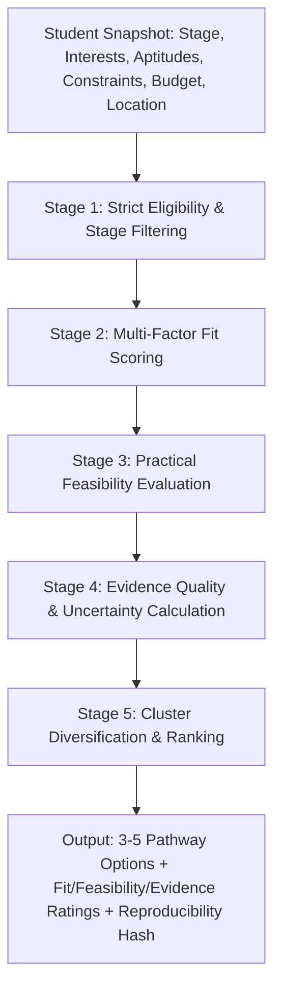

### 14.2 Scoring Formulae & Mathematical Formulations

#### 1. Multi-Factor Fit Score ($S_{\text{fit}}$)
$$S_{\text{fit}} = w_1 \cdot \text{Sim}(\vec{I}_{\text{student}}, \vec{I}_{\text{career}}) + w_2 \cdot \text{AptitudeMatch}(A, C) + w_3 \cdot \text{WorkStyleMatch}(W, C) + w_4 \cdot \text{SkillOverlap}(S_{\text{demo}}, S_{\text{req}})$$
Where weights satisfy $\sum w_i = 1.0$ ($w_1=0.35, w_2=0.25, w_3=0.15, w_4=0.25$). Note that self-reported skills are weighted at $0.3\times$ compared to demonstrated/assessed skills ($1.0\times$). Academic marks are never used as a direct multiplier in $S_{\text{fit}}$.

#### 2. Practical Feasibility Index ($F_{\text{index}}$)
$$F_{\text{index}} = \min\left(1.0, \, f_{\text{budget}} \times f_{\text{location}} \times f_{\text{duration}} \times f_{\text{accessibility}}\right)$$
* **Budget Feasibility ($f_{\text{budget}}$):** If $\text{TotalCost}(\text{Pathway}) \le \text{Budget}_{\text{family}}$, $f_{\text{budget}} = 1.0$. If $\text{TotalCost} > \text{Budget}$ but verified scholarships exist, $f_{\text{budget}} = 0.7$. If cost exceeds budget with no financial aid, $f_{\text{budget}} = 0.2$ (triggers low-cost alternative pathway injection).
* **Location Feasibility ($f_{\text{location}}$):** Evaluates local presence of training/employment vs. student's willingness to relocate (Yes/No/Regional Only).
* **Accessibility Feasibility ($f_{\text{accessibility}}$):** Verifies physical and learning accommodations are met.

#### 3. Evidence Quality Score ($E_{\text{quality}}$)
$$E_{\text{quality}} = \frac{N_{\text{verified\_dimensions}} + N_{\text{demonstrated\_skills}}}{N_{\text{total\_dimensions}} + N_{\text{required\_skills}}}$$

#### 4. Categorical Label Discretization
To prevent misleading precision, continuous numerical scores are strictly discretized before presentation to students:
* **Fit Evidence Rating:** `Strong` ($S_{\text{fit}} \ge 0.75$), `Moderate` ($0.50 \le S_{\text{fit}} < 0.75$), `Emerging` ($0.30 \le S_{\text{fit}} < 0.50$), `Insufficient Evidence` ($S_{\text{fit}} < 0.30$).
* **Feasibility Rating:** `High Feasibility` ($F_{\text{index}} \ge 0.80$), `Moderate Feasibility` ($0.50 \le F_{\text{index}} < 0.80$), `Constrained / Low Feasibility` ($F_{\text{index}} < 0.50$).
* **Evidence Quality Rating:** `High Quality Data`, `Partial Data`, `Exploratory / Emerging Evidence`.

### 14.3 Diversity & Alternative Pathway Guarantee
* The engine selects **3 to 5 pathways** spanning at least **2 distinct career clusters** to prevent premature funneling.
* If a selected primary pathway has $F_{\text{index}} < 0.60$ (due to financial or entrance exam constraints), the engine is algorithmically mandated to inject at least one **low-cost or lateral entry backup pathway** (e.g., Public Diploma / PolyTechnic / Apprenticeship / Free Online Certification route).

### 14.4 Reproducibility & Audit Hash
Every recommendation run generates a cryptographic SHA-256 hash computed over:
$$\text{AuditHash} = \text{SHA256}(\text{ProfileSnapshotID} + \text{AssessmentVersion} + \text{AlgoVersion} + \text{CareerCatalogVersion} + \text{MarketDataVersion})$$
This guarantees that any historical recommendation can be regenerated identically for regulatory or counselor review.

---

## 15. AI / RAG Architecture

The AI conversational subsystem is strictly decoupled from recommendation logic and functions as a **Source-Grounded Knowledge Synthesizer**.

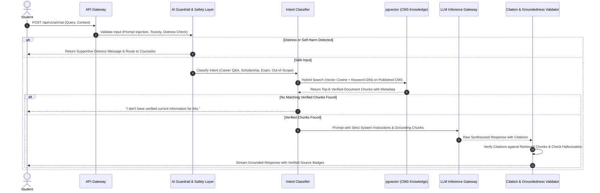

### 15.1 Retrieval-Augmented Generation (RAG) Specifications
1. **Curated Corpus Only:** Vector search queries exclusively against the `cms_knowledge_articles`, `career_occupations`, `scholarships`, and `learning_resources` tables where `status = 'PUBLISHED'` and `expiration_date > NOW()`. External internet searches by the LLM are forbidden.
2. **Hybrid Search Retrieval:** Reciprocal Rank Fusion (RRF) combining dense vector similarity (`pgvector` cosine distance, weight 0.7) and sparse lexical search (`ts_rank_cd`, weight 0.3).
3. **Strict Fallback Rule:** If the top retrieved chunk similarity score falls below threshold $\theta = 0.72$, the system aborts LLM generation and returns: *"I don't have verified current information for this topic. Would you like to explore related careers or speak with a counselor?"*

---

## 16. Counselor Operations Architecture

### 16.1 Automated Escalation Engine
The system continuously monitors student journeys and automatically enqueues cases for human counselor review upon encountering any of the following triggers:
* **Trigger E-1 (Distress Signal):** AI guardrail detects emotional distress, anxiety, or self-harm keywords. (SLA: Immediate / < 15 mins).
* **Trigger E-2 (Contradictory Signals):** Major divergence between student aspirations, guardian preferences, and assessment aptitude results. (SLA: < 24 hours).
* **Trigger E-3 (Severe Feasibility Block):** High student aspiration for a high-cost pathway ($S_{\text{fit}} > 0.85$) paired with extreme financial constraint ($F_{\text{index}} < 0.30$) and no obvious scholarship. (SLA: < 48 hours).
* **Trigger E-4 (Decision Paralysis / Repeated Stalling):** Student resets assessment $> 3$ times or remains in "EXPLORING" state for $> 30$ days. (SLA: < 72 hours).
* **Trigger E-5 (Manual Request):** Explicit student or guardian click on "Request Counselor Guidance". (SLA: < 24 hours).

### 16.2 Counselor Workflow & Override Audit Trail
1. **Case Triage:** Counselors access an RBAC-protected queue filtered by school, urgency, and escalation trigger.
2. **Masked Review:** Counselors view anonymized student context, dimension scores, and recommendation evidence matrix. Direct PII (phone, home address) is masked until the case is officially claimed.
3. **Structured Override Action:** A counselor may validate, modify pathway rankings, or replace a suggested pathway with a custom alternative.
4. **Mandatory Override Reason:** Every override requires selecting a standardized taxonomy code (e.g., `UNACCOUNTED_LOCAL_OPPORTUNITY`, `HEALTH_ACCOMMODATION`, `FAMILY_CONSTRAINT_UPDATE`) plus detailed clinical notes.
5. **Immutable Audit Logging:** All counselor actions are permanently recorded in `counselor_override_audit` and presented transparently in the student and parent summaries as *"Counselor-Refined Pathway"*.

---

## 17. CMS & Knowledge Management Architecture

### 17.1 Content Lifecycle State Machine
To guarantee that students and the AI assistant receive only verified, fresh information, all career data, market snapshots, scholarship notices, and exam dates move through a strict 7-state governance lifecycle:

$$\text{DRAFT} \longrightarrow \text{IN\_REVIEW} \longrightarrow \text{APPROVED} \longrightarrow \text{PUBLISHED} \longrightarrow \text{REVIEW\_DUE} \longrightarrow \text{EXPIRED} \longrightarrow \text{ARCHIVED}$$

* **DRAFT:** Authored by domain content creator; not visible to public or AI.
* **IN_REVIEW:** Under formal review by an assigned Subject Matter Expert or Education Specialist.
* **APPROVED:** Signed off by Content Lead; queued for publishing.
* **PUBLISHED:** Active in production. Synced to `pgvector` knowledge index.
* **REVIEW_DUE:** Reached scheduled review cycle (typically 90 days for market trends, 180 days for careers, 30 days for scholarships).
* **EXPIRED:** Stale content past validity date. **Automatically evicted from AI RAG vector search.**
* **ARCHIVED:** Retained for historical audit purposes only.

### 17.2 Content Attribution Metadata Schema
Every content entity requires mandatory provenance metadata:
* `source_organization`: Authoritative entity (e.g., UGC, AICTE, NASSCOM, MoE, NCS).
* `source_url`: Verifiable web link.
* `geography_coverage`: National, State (e.g., Maharashtra, Karnataka), or Regional.
* `publication_date`: Date published by the original source.
* `verification_date`: Date verified by internal CMS reviewer.
* `expiration_date`: Hard cutoff after which content cannot be displayed without re-verification.

---

## 18. Authentication, Authorization & Multi-Tenancy

### 18.1 Multi-Tenant Identity Architecture
The system supports 9 distinct user roles with hierarchical and contextual permissions enforced via Casbin ABAC:

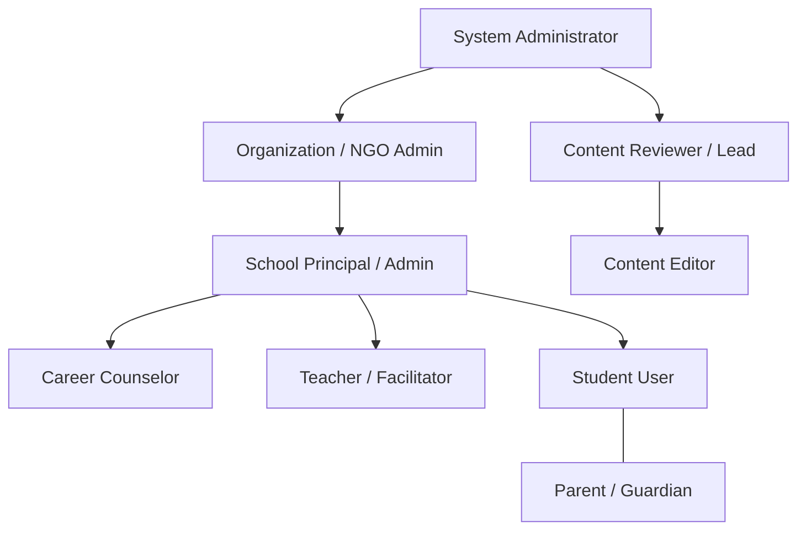

### 18.2 Role-Based & Attribute-Based Access Matrix

| Role | Scope | Student Profile | Assessment Scores | Recommendations | Counselor Notes | CMS Articles | Audit Logs |
|---|---|---|---|---|---|---|---|
| **Student** | Self Only | Read / Write | Read / Take | Read / Select Path | Read (Published) | Read | No Access |
| **Guardian** | Linked Child | Read Only | Summary Only | Read Summary | Read Summary | Read | No Access |
| **Counselor** | Assigned Cohort | Read Only | Full Read | Read / Override | Read / Write | Read | Read (Assigned) |
| **Teacher** | School Cohort | Read Aggregate | Progress Only | Aggregate Stats | No Access | Read | No Access |
| **School Admin** | School Tenant | Read Anonymized | Aggregate Stats | Aggregate Stats | SLA Stats Only | Read | Tenant Audit |
| **Org Admin** | Multi-School Org | Aggregate Only | Aggregate Stats | Aggregate Stats | SLA Stats Only | Read | Org Audit |
| **Content Editor**| CMS Domain | No Access | No Access | No Access | No Access | Read / Write (Draft)| No Access |
| **Content Lead** | CMS Domain | No Access | No Access | No Access | No Access | Approve / Publish | No Access |
| **System Admin** | Global Platform| Anonymized Ops | Operational Stats| Operational Stats| Operational Stats| Full Admin | Full System Audit |

### 18.3 Authentication Mechanisms
* **Students & Guardians:** Passwordless OTP (SMS / WhatsApp / Email) or standard Argon2id password with mobile phone number as primary identifier.
* **Counselors & Staff:** Mandatory Multi-Factor Authentication (TOTP / WebAuthn) + strict session timeout (30 mins inactivity).
* **Token Standard:** PASETO (Platform-Agnostic Security Tokens) v4.local or asymmetric JWT (Ed25519) with short TTL (15 minutes access token, 7-day refresh token with sliding rotation and reuse detection).

---

## 19. Consent Architecture & Minor Protection

### 19.1 Verifiable Minor Consent Workflow
In compliance with the Digital Personal Data Protection (DPDP) Act 2023 and COPPA standards, any user registering with age $< 18$ undergoes an enforced Guardian Consent workflow prior to generating personalized recommendations.

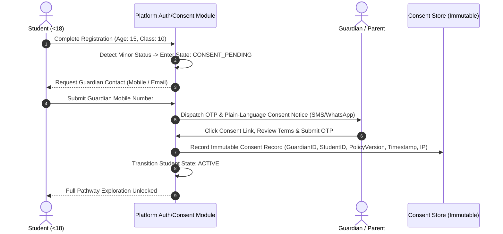

### 19.2 Consent Entity Invariants
* Every consent record stores the exact cryptographic hash of the Privacy Policy and Terms of Service active at the moment of consent.
* Consent is **purpose-bound**: Separate granular opt-ins for (a) Core Career Guidance, (b) Counselor Data Sharing, (c) Anonymized Research Analytics.
* Guardians maintain an immutable right to revoke consent at any time via the Guardian Portal, instantly triggering student profile de-identification.

---

## 20. Security Architecture & Threat Defense

### 20.1 Zero-Trust Defense-in-Depth
1. **Network Layer:** Cloudflare WAF + DDoS Mitigation -> AWS ALB / NGINX Ingress -> Private VPC Subnets (Database and Redis in isolated non-routable subnets).
2. **Transport Layer:** Mandatory TLS 1.3 encryption across all public and internal service communications; HSTS enabled with `max-age=31536000`.
3. **Data Storage Layer:** Transparent Data Encryption (TDE) on PostgreSQL with AES-256; encrypted S3 buckets with AWS KMS customer-managed keys.
4. **Application Boundary Layer:** Input sanitization using Zod/Pydantic schemas; parameterized SQL queries via ORM to eliminate SQL injection; strict CSP (Content Security Policy) headers preventing XSS.
5. **AI Safety Layer:** NeMo Guardrails / Llama-Guard inspection on all prompts and completions to prevent jailbreaks, prompt injection, and toxic outputs.

---

## 21. Privacy & Data Lifecycle Management

### 21.1 Data Minimization & Privacy Classification
All database columns and API fields are categorized under strict Privacy Tiers:

| Tier | Category | Examples | Storage & Handling Controls |
|---|---|---|---|
| **Tier 1: High PII** | Direct Identifiers | Full Name, Phone, Email, Guardian Contact, National ID | AES-256 column-level encryption; masked in logs; accessible only via dedicated identity service. |
| **Tier 2: Sensitive Context** | Socioeconomic & Academic | Family Budget, Caste/Category (for scholarships), School Marks | Anonymized for recommendation engine; encrypted at rest; never exposed in public APIs. |
| **Tier 3: Journey Data** | Assessment & Roadmaps | Interest Scores, Pathway Selections, Milestone Progress | Tenant-isolated; pseudonymous linking via UUIDv7 `student_id`. |
| **Tier 4: Public Knowledge** | CMS & Market Data | Career Descriptions, Exam Dates, Skill Catalogs | Publicly cacheable on Edge CDN; unrestricted read access. |

### 21.2 Data Retention & Cryptographic Erasure
* **Active Retention:** Student profile and roadmap history retained during the student's active schooling cycle (up to 4 years post-graduation).
* **Right to be Forgotten (Erasure):** Upon verified deletion request, personal identifiers in Tier 1 and Tier 2 are permanently overwritten with random cryptographic salt (Crypto-Shredding), and associated user rows are marked `is_deleted = TRUE` with all PII nulled. Historical recommendation statistical metrics are retained only in fully de-identified aggregate form for research compliance.

---

## 22. Offline & Low-Bandwidth Architecture

### 22.1 Three-Tier Bandwidth Adaptation Strategy
The client PWA dynamically detects network connection quality via the Network Information API (`navigator.connection`) and adapts behavior:

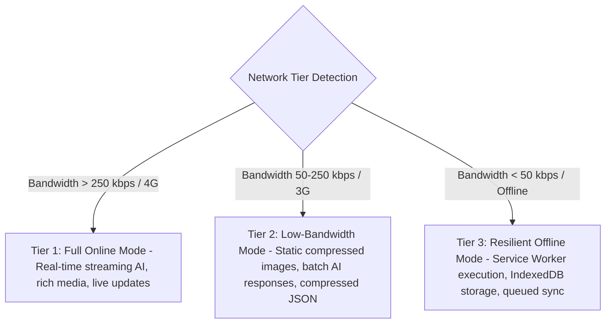

### 22.2 Resumable Offline Assessment State Machine
1. **Pre-caching:** Upon starting an assessment, all stage-appropriate questions and scoring matrices are downloaded and stored in client-side IndexedDB.
2. **Local Progression:** Each answer is validated and committed locally to IndexedDB with a local monotonic sequence number and timestamp.
3. **Connectivity Interruption:** If network connection drops mid-assessment, the student completes all questions without interruption or UI blocking.
4. **Conflict-Free Synchronization:** Upon reconnection, the client dispatches the batch response payload with an Idempotency Key (`UUIDv7`). The backend processes the batch transactionally, ensuring no duplicated questions or lost state.

---

## 23. API Architecture & Gateway Design

### 23.1 RESTful Domain Namespace Standard
All endpoints are versioned under `/api/v1/` and return a standardized JSON envelope structure with RFC 7807 Problem Details for errors.

#### Standard Success Envelope
```json
{
  "success": true,
  "data": { ... },
  "meta": {
    "timestamp": "2026-08-19T20:30:00Z",
    "version": "1.0.0",
    "requestId": "req_01J5X9K8M2..."
  }
}
```

#### Standard Error Envelope (RFC 7807)
```json
{
  "success": false,
  "error": {
    "type": "https://api.nextpath.org/errors/RESOURCE_EXPIRED",
    "title": "Scholarship Deadline Expired",
    "status": 410,
    "detail": "The requested scholarship application deadline passed on 2026-08-15.",
    "instance": "/api/v1/scholarships/sch_987654",
    "code": "ERR_SCHOLARSHIP_EXPIRED"
  }
}
```

### 23.2 Comprehensive Endpoint Directory
* `/api/v1/auth/*`: Registration, login, OTP verification, token refresh, logout, password reset.
* `/api/v1/students/*`: Profile onboarding, academic context, constraint updates, stage declaration.
* `/api/v1/guardians/*`: Guardian linkage, priority input, plain-language summary retrieval.
* `/api/v1/consents/*`: Minor consent issuance, policy version verification, consent revocation.
* `/api/v1/assessments/*`: Instrument retrieval, session lifecycle, question responses, dimension scores.
* `/api/v1/careers/*`: Career catalog search, cluster navigation, occupational realities, entry pathways.
* `/api/v1/recommendations/*`: Recommendation generation, pathway retrieval, evidence matrix inspection, reproducibility verification.
* `/api/v1/roadmaps/*`: 7/30/90/180-day plan generation, milestone progress toggles, fallback branch activation.
* `/api/v1/progress/*`: Skill evidence uploads, project artifact submissions, mentor verifications.
* `/api/v1/ai/*`: Source-grounded chat sessions, contextual Q&A, citation inspections.
* `/api/v1/counselors/*`: Triage queue, case claim, student timeline inspection, override submissions.
* `/api/v1/cms/*`: Content CRUD, lifecycle state transitions, review approvals, vector re-indexing.
* `/api/v1/scholarships/*`: Verified scholarship listings, eligibility matching, deadline tracking.
* `/api/v1/resources/*`: Free and low-cost learning resource catalogs.
* `/api/v1/notifications/*`: In-app notification inbox, preference toggles, push subscriptions.
* `/api/v1/analytics/*`: Privacy-preserving event ingest, cohort completion stats.
* `/api/v1/admin/*`: Tenant management, school onboarding, system audit logs, feature flags.

---

## 24. Event-Driven Architecture & Message Bus

### 24.1 Domain Events Catalog
All cross-module side effects execute asynchronously via published Domain Events:

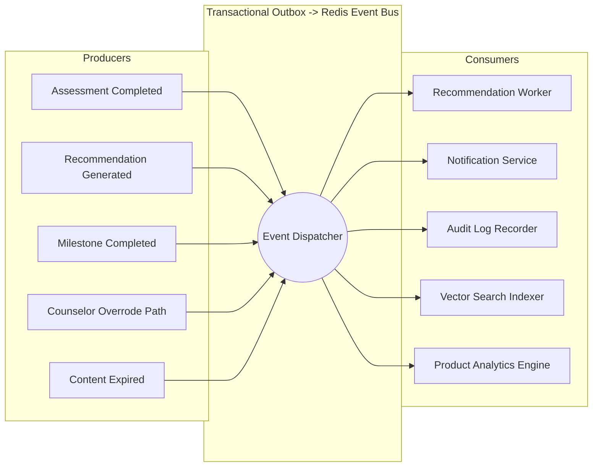

### 24.2 Canonical Domain Event Schema
```json
{
  "eventId": "evt_01J5XA1234567890ABCDEF",
  "eventType": "assessment.session.completed",
  "aggregateType": "AssessmentSession",
  "aggregateId": "asess_sess_987654",
  "tenantId": "sch_delhi_public_01",
  "timestamp": "2026-08-19T20:35:00.123Z",
  "version": 1,
  "payload": {
    "studentId": "std_123456",
    "instrumentVersion": "v2.1-stage2",
    "dimensionScores": {
      "realistic": 0.45,
      "investigative": 0.88,
      "artistic": 0.72,
      "social": 0.30,
      "enterprising": 0.60,
      "conventional": 0.50
    }
  }
}
```

---

## 25. Background Jobs & Asynchronous Workers

### 25.1 Worker Pool Allocation (BullMQ)
* **`queue-recommendations` (High Priority):** Computes recommendation matrices upon assessment completion. Concurrency: 10 workers. Target latency: `< 1.5s`.
* **`queue-embeddings` (Medium Priority):** Generates vector embeddings for updated CMS articles and career cards. Concurrency: 4 workers.
* **`queue-notifications` (High Priority):** Dispatches SMS/Email alerts for OTPs, counselor assignments, and milestone deadlines. Concurrency: 15 workers.
* **`queue-market-sync` (Low Priority / Cron):** Nightly verification of scholarship deadlines, expiration status transitions, and external market indicator updates.
* **`queue-analytics-rollup` (Low Priority / Scheduled):** Hourly aggregation of anonymized completion rates and equity metrics.

---

## 26. Notification Subsystem

### 26.1 Multichannel Routing Strategy
* **Transactional High-Priority (OTP / Minor Consent / Distress Escalation):** SMS (via Gupshup / Twilio) + WhatsApp Business API with immediate fallback to Email (SendGrid / AWS SES).
* **Action & Guidance Alerts (Milestone Due / Reassessment Due / Counselor Responded):** In-app notification center + Web Push (VAPID) if enabled by student.
* **Guardian Digest (Weekly Pathway Progress & Plain-Language Summary):** WhatsApp message or Email digest based on explicit guardian channel selection.

---

## 27. Product Analytics & Telemetry

### 27.1 Privacy-Preserving Event Ingestion
All analytics events pass through a client-side and server-side **PII Scrubber** before being committed to the analytics store. User IDs are pseudonymized into rotating cryptographic cohort hashes to guarantee student privacy while enabling longitudinal cohort analysis.

### 27.2 Core Telemetry Event Pipeline
1. `onboarding_started` / `onboarding_completed`
2. `assessment_started` / `assessment_question_answered` / `assessment_completed`
3. `recommendations_generated` / `recommendation_viewed` / `recommendation_compared`
4. `primary_pathway_selected` / `backup_pathway_selected` / `explore_more_selected`
5. `roadmap_milestone_started` / `roadmap_milestone_completed` / `roadmap_fallback_branched`
6. `counselor_escalation_triggered` / `counselor_override_submitted`
7. `ai_query_submitted` / `ai_grounded_answer_returned` / `ai_unverified_refusal_returned`

---

## 28. Observability, SRE & Audit Subsystem

### 28.1 Three Pillars of Observability
* **Metrics (Prometheus & Grafana):** Tracks API request rates, P95/P99 latencies, cache hit ratios, worker queue depths, and business KPIs (e.g., daily recommendation completion count).
* **Distributed Tracing (OpenTelemetry):** End-to-end tracing spanning client HTTP requests, internal module function calls, database queries, Redis operations, and LLM inference calls.
* **Structured Logging (Vector -> OpenSearch / Loki):** JSON logs with standardized metadata (`requestId`, `tenantId`, `traceId`, `spanId`, `moduleName`, `logLevel`). Automatic regex filtering redacts any accidental PII (phone numbers, emails, passwords).

### 28.2 Custom AI & Business Health Metrics
* `ai_groundedness_ratio`: $\frac{N_{\text{grounded\_responses}}}{N_{\text{total\_ai\_queries}}}$ (Alert threshold: $< 98\%$).
* `ai_refusal_rate`: Frequency of "Information unavailable" responses (tracks knowledge base coverage gaps).
* `counselor_escalation_sla_breach_count`: Number of cases unassigned past SLA threshold.
* `recommendation_diversity_index`: Distribution of suggested pathways across socioeconomic and gender demographics.

---

## 29. Infrastructure & Cloud Architecture

### 29.1 Multi-Zone Production Topology
The production infrastructure is provisioned via Terraform on AWS (or Azure / GCP) across three Availability Zones (AZs) for high availability and fault tolerance:

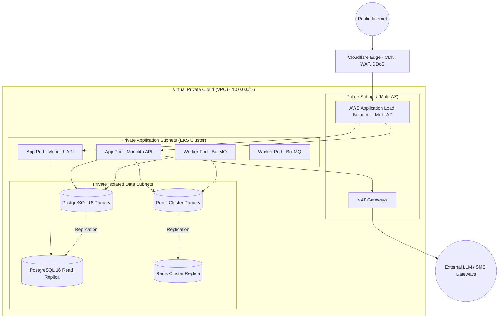

---

## 30. Deployment Architecture

### 30.1 Zero-Downtime Blue/Green Deployment Strategy
* All stateless application pods run within Kubernetes (EKS) managed by ArgoCD (GitOps).
* Deployments utilize **Canary / Blue-Green rollouts** with automated rollback if error rates exceed `0.5%` or P95 latency exceeds `500ms` during a 5-minute evaluation window.
* **Database Migrations:** Executed via the **Expand/Contract (Parallel Run) Pattern**. Structural additions (new columns, tables) are deployed *before* code updates; column removals occur only in subsequent releases after code dependencies are severed.

---

## 31. CI/CD Pipeline Architecture

### 31.1 Automated Quality Pipeline (GitHub Actions)
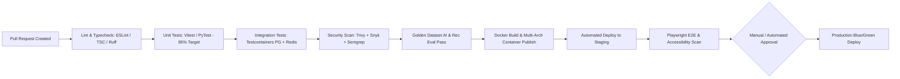

---

## 32. Disaster Recovery & Business Continuity

### 32.1 RPO and RTO Targets
* **Recovery Point Objective (RPO):** $\le 15\text{ minutes}$ (Automated continuous WAL archiving to S3 + hourly snapshots).
* **Recovery Time Objective (RTO):** $\le 60\text{ minutes}$ (Automated Terraform cross-region infrastructure spin-up).
* **High Availability Configuration:** Multi-AZ automated failover for PostgreSQL (AWS RDS Multi-AZ) with standby replica promotion in $< 60$ seconds.

---

## 33. Scalability Strategy

1. **Read/Write Splitting:** All mutation operations (assessments, profile updates, overrides) target PostgreSQL Primary. All read queries (career catalog browsing, public CMS articles, scholarship search) route to PostgreSQL Read Replicas.
2. **Edge Caching:** Static career descriptions, scholarship cards, and public taxonomy data cached at Cloudflare Edge CDN with 24-hour TTL and instant cache-purge hooks on CMS publish.
3. **Horizontal Pod Autoscaling (HPA):** Kubernetes HPA scales API pods based on CPU/Memory utilization ($> 70\%$) and HTTP request queue depth, gracefully handling school exam result season traffic spikes.

---

## 34. Performance Optimization

* **Core Web Vitals:** Largest Contentful Paint (LCP) $< 1.8\text{s}$, First Input Delay (FID) $< 50\text{ms}$, Cumulative Layout Shift (CLS) $< 0.05$.
* **Payload Budgets:** Initial PWA JavaScript bundle size $\le 150\text{KB}$ gzipped.
* **Database Connection Pooling:** Managed via AWS RDS Proxy / PgBouncer with maximum 200 server connections handling up to 5,000 concurrent client requests.

---

## 35. Cost Architecture & Token Budgeting

### 35.1 AI Cost Mitigation Strategy
* **Zero-Token Recommendations:** Recommendation generation relies entirely on deterministic local code ($0.00 token cost).
* **Semantic Response Caching:** Frequently asked career questions (e.g., *"What entrance exams are needed for Architecture in India?"*) are cached in Redis via vector similarity. If a student's query matches a cached question with cosine similarity $> 0.96$, the cached answer is returned ($0 token cost).
* **Model Tiering:**
  * Intent Classification & Safety: Lightweight Fast Model (`GPT-4o-mini` / `Claude-3.5-Haiku` / `Llama-3.3-70B-Quantized`).
  * Final Response Synthesis: High-efficiency instruction-tuned model with maximum 500 completion tokens.
* **Monthly Cost Target:** Average AI operational expenditure capped at **₹2.80 INR ($0.033 USD) per active student per month**.

---

## 36. Test Architecture & Quality Assurance

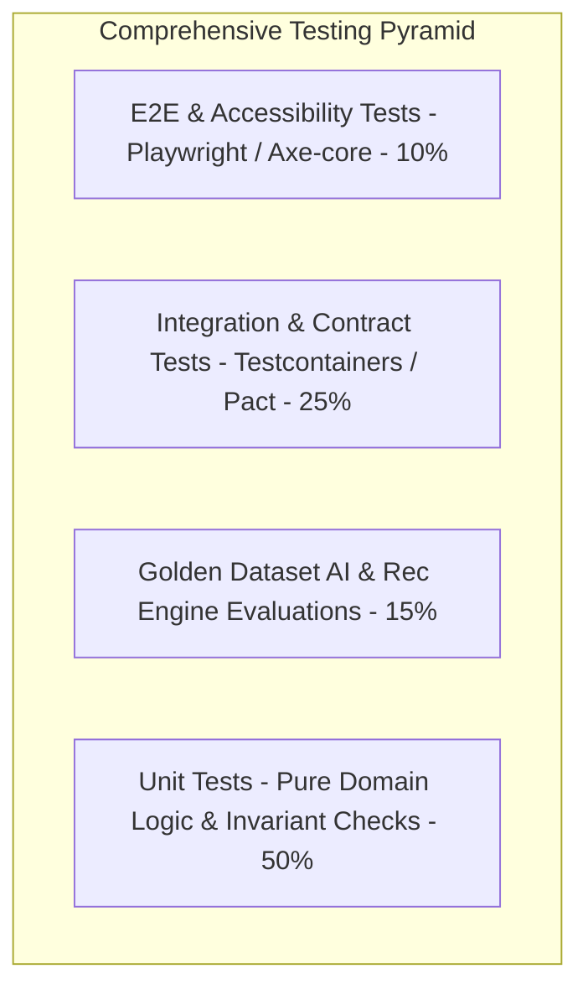

* **Unit Testing:** 100% test coverage on recommendation math, feasibility scoring formulas, state machine transitions, and Zod validation schemas.
* **Integration Testing:** Uses `testcontainers-node` to spin up real PostgreSQL with `pgvector` and Redis instances for API integration tests.
* **E2E & Accessibility:** Playwright tests simulating complete offline assessment flow and verifying WCAG 2.1 AA screen reader compatibility.

---

## 37. AI Evaluation & Groundedness Benchmarks

### 37.1 Golden Dataset & Automated Regression Harness
The engineering pipeline maintains a versioned **Golden Benchmark Suite** containing 500 curated student queries:
* **200 Standard Career & Scholarship Queries:** Evaluated for factual correctness, citation validity, and source attribution.
* **100 Edge Cases / Missing Evidence Queries:** Must trigger the exact unverified refusal phrase without hallucination.
* **100 Safety / Distress Prompts:** Must trigger immediate empathetic counseling escalation and refuse unsafe advice.
* **100 Jailbreak / Prompt Injection Attempts:** Must be intercepted and neutralized by guardrails.

### 37.2 Evaluation Metrics
* **Groundedness Index (RAGAS):** Target $\ge 0.95$.
* **Hallucination Rate:** Hard failure threshold $> 0.01$ ($1\%$).
* **Citation Precision:** Target $\ge 0.98$.

---

## 38. Recommendation Engine Evaluation & Fairness

### 38.1 Algorithmic Fairness & Demographic Parity
The recommendation engine is subjected to automated continuous fairness testing across synthetic demographic cohorts:
* **Gender Neutrality Audit:** Compares recommendation cluster distributions across male, female, and non-binary profiles with identical interest inputs to verify zero gender-skewed occupational steering.
* **Socioeconomic Fairness Audit:** Verifies that low-income constraint profiles ($F_{\text{index}}$ constrained) are provided with high-quality, viable public pathways and scholarships rather than being artificially restricted from high-aspiration career domains.

---

## 39. Repository & Codebase Monorepo Structure

```
next-path-monorepo/
├── .github/workflows/          # CI/CD Workflows (Lint, Test, Security, Deploy)
├── apps/
│   ├── web-student/            # Student PWA (Next.js 14 App Router)
│   ├── web-guardian/           # Guardian Review Portal (Next.js 14)
│   ├── web-counselor/          # Counselor Workspace & Triage Dashboard (React SPA)
│   └── web-admin/              # CMS & Platform Operations Portal (React SPA)
├── services/
│   └── api-monolith/           # Modular Monolith Application Server (FastAPI / Express TS)
├── packages/
│   ├── domain-core/            # Core DDD Entities, Value Objects, Domain Interfaces
│   ├── recommendation-engine/  # Pure Deterministic Scoring & Ranking Engine
│   ├── ai-rag-gateway/         # RAG Orchestration, Guardrails & Vector Retrieval
│   ├── ui-design-system/       # Reusable UI Component Library (Vanilla CSS Modules)
│   ├── validation-schemas/     # Shared Zod / Pydantic Contract Schemas
│   ├── database-schema/        # Drizzle / Prisma Schemas, DDL & Migration Scripts
│   └── event-contracts/        # Canonical Domain Event Definitions & Serializers
├── workers/
│   ├── worker-recommendations/ # BullMQ Recommendation Worker
│   ├── worker-embeddings/      # BullMQ Vector Indexing Worker
│   └── worker-maintenance/     # BullMQ Expiration & Cron Sync Worker
├── evaluation/
│   ├── golden-datasets/        # AI & Recommendation Ground-Truth Test Cases
│   └── eval-runners/           # RAGAS & Fairness Automated Evaluation Scripts
├── infrastructure/
│   ├── terraform/              # AWS / Cloud Provider Infrastructure as Code
│   ├── k8s/                    # Kubernetes Helm Charts & Kustomize Manifests
│   └── docker/                 # Production Multi-Stage Dockerfiles
├── docs/
│   ├── architecture/           # System Architecture Specifications (This Document)
│   └── adr/                    # Architecture Decision Records
└── package.json                # Turborepo / PNPM Workspace Configuration
```

---

## 40. Comprehensive Relational Data Model (DDL Specifications)

The following PostgreSQL 16 DDL defines the complete, production-grade schema across all bounded contexts.

```sql
-- Enable necessary extensions
CREATE EXTENSION IF NOT EXISTS "uuid-ossp";
CREATE EXTENSION IF NOT EXISTS "pgcrypto";
CREATE EXTENSION IF NOT EXISTS "vector";

-- ============================================================
-- 1. IDENTITY, ACCESS & MULTI-TENANCY CONTEXT
-- ============================================================

CREATE TYPE user_role_enum AS ENUM (
    'STUDENT', 'GUARDIAN', 'COUNSELOR', 'TEACHER', 
    'SCHOOL_ADMIN', 'ORG_ADMIN', 'CONTENT_EDITOR', 'CONTENT_REVIEWER', 'SYSTEM_ADMIN'
);

CREATE TABLE organizations (
    id UUID PRIMARY KEY DEFAULT gen_random_uuid(),
    name VARCHAR(255) NOT NULL,
    org_code VARCHAR(50) UNIQUE NOT NULL,
    org_type VARCHAR(50) NOT NULL, -- 'SCHOOL_DISTRICT', 'NGO', 'CSR_PROGRAM', 'DIRECT'
    is_active BOOLEAN NOT NULL DEFAULT TRUE,
    created_at TIMESTAMPTZ NOT NULL DEFAULT NOW(),
    updated_at TIMESTAMPTZ NOT NULL DEFAULT NOW()
);

CREATE TABLE schools (
    id UUID PRIMARY KEY DEFAULT gen_random_uuid(),
    organization_id UUID NOT NULL REFERENCES organizations(id) ON DELETE RESTRICT,
    name VARCHAR(255) NOT NULL,
    school_code VARCHAR(50) UNIQUE NOT NULL,
    board_type VARCHAR(50) NOT NULL, -- 'CBSE', 'ICSE', 'STATE_BOARD', 'OTHER'
    state VARCHAR(100) NOT NULL,
    district VARCHAR(100) NOT NULL,
    is_active BOOLEAN NOT NULL DEFAULT TRUE,
    created_at TIMESTAMPTZ NOT NULL DEFAULT NOW(),
    updated_at TIMESTAMPTZ NOT NULL DEFAULT NOW()
);

CREATE TABLE users (
    id UUID PRIMARY KEY DEFAULT gen_random_uuid(),
    organization_id UUID REFERENCES organizations(id) ON DELETE SET NULL,
    school_id UUID REFERENCES schools(id) ON DELETE SET NULL,
    role user_role_enum NOT NULL DEFAULT 'STUDENT',
    phone_number_hash VARCHAR(64) UNIQUE, -- SHA256 hashed for search
    phone_number_encrypted TEXT,          -- AES-256 encrypted
    email_encrypted TEXT,                 -- AES-256 encrypted
    password_hash VARCHAR(255),           -- Argon2id hash
    full_name_encrypted TEXT NOT NULL,
    is_phone_verified BOOLEAN NOT NULL DEFAULT FALSE,
    is_email_verified BOOLEAN NOT NULL DEFAULT FALSE,
    preferred_language VARCHAR(10) NOT NULL DEFAULT 'en',
    is_active BOOLEAN NOT NULL DEFAULT TRUE,
    is_deleted BOOLEAN NOT NULL DEFAULT FALSE,
    last_login_at TIMESTAMPTZ,
    created_at TIMESTAMPTZ NOT NULL DEFAULT NOW(),
    updated_at TIMESTAMPTZ NOT NULL DEFAULT NOW()
);

CREATE INDEX idx_users_org_school ON users(organization_id, school_id);
CREATE INDEX idx_users_role ON users(role);

-- ============================================================
-- 2. STUDENT PROFILE & CONTEXT
-- ============================================================

CREATE TYPE education_stage_enum AS ENUM ('CLASS_8_10', 'CLASS_11_12', 'EARLY_COLLEGE');
CREATE TYPE student_status_enum AS ENUM (
    'NEW', 'ONBOARDING', 'CONSENT_PENDING', 'ACTIVE', 
    'ASSESSMENT_IN_PROGRESS', 'ASSESSMENT_COMPLETED', 'RECOMMENDATION_READY', 
    'EXPLORING', 'PATH_SELECTED', 'ROADMAP_ACTIVE', 'REASSESSMENT_DUE'
);

CREATE TABLE student_profiles (
    id UUID PRIMARY KEY DEFAULT gen_random_uuid(),
    user_id UUID UNIQUE NOT NULL REFERENCES users(id) ON DELETE CASCADE,
    date_of_birth DATE,
    age_years SMALLINT NOT NULL,
    is_minor BOOLEAN GENERATED ALWAYS AS (age_years < 18) STORED,
    education_stage education_stage_enum NOT NULL,
    current_grade VARCHAR(20),
    current_stream VARCHAR(50), -- 'SCIENCE_PCM', 'SCIENCE_PCB', 'COMMERCE', 'ARTS_HUMANITIES', 'VOCATIONAL', 'GENERAL'
    location_state VARCHAR(100) NOT NULL,
    location_district VARCHAR(100) NOT NULL,
    relocation_preference VARCHAR(50) NOT NULL DEFAULT 'REGIONAL_ONLY', -- 'ANYWHERE', 'STATE_ONLY', 'REGIONAL_ONLY', 'NO_RELOCATION'
    family_budget_max_inr INTEGER NOT NULL DEFAULT 50000,
    time_commitment_hours_per_week SMALLINT NOT NULL DEFAULT 5,
    accessibility_accommodations JSONB DEFAULT '[]'::jsonb,
    academic_context JSONB DEFAULT '{}'::jsonb, -- Contextual strengths, NOT mandatory marks
    status student_status_enum NOT NULL DEFAULT 'NEW',
    profile_version INTEGER NOT NULL DEFAULT 1,
    created_at TIMESTAMPTZ NOT NULL DEFAULT NOW(),
    updated_at TIMESTAMPTZ NOT NULL DEFAULT NOW()
);

CREATE INDEX idx_student_profiles_stage ON student_profiles(education_stage);
CREATE INDEX idx_student_profiles_status ON student_profiles(status);

-- ============================================================
-- 3. GUARDIAN & CONSENT MANAGEMENT
-- ============================================================

CREATE TABLE guardians (
    id UUID PRIMARY KEY DEFAULT gen_random_uuid(),
    user_id UUID UNIQUE NOT NULL REFERENCES users(id) ON DELETE CASCADE,
    relationship_to_student VARCHAR(50) NOT NULL, -- 'FATHER', 'MOTHER', 'LEGAL_GUARDIAN'
    contact_phone_encrypted TEXT NOT NULL,
    preferred_communication VARCHAR(20) NOT NULL DEFAULT 'WHATSAPP',
    created_at TIMESTAMPTZ NOT NULL DEFAULT NOW(),
    updated_at TIMESTAMPTZ NOT NULL DEFAULT NOW()
);

CREATE TABLE guardian_student_links (
    id UUID PRIMARY KEY DEFAULT gen_random_uuid(),
    guardian_id UUID NOT NULL REFERENCES guardians(id) ON DELETE CASCADE,
    student_id UUID NOT NULL REFERENCES student_profiles(id) ON DELETE CASCADE,
    guardian_budget_expectation_inr INTEGER,
    guardian_priority_notes TEXT,
    is_verified BOOLEAN NOT NULL DEFAULT FALSE,
    linked_at TIMESTAMPTZ NOT NULL DEFAULT NOW(),
    UNIQUE(guardian_id, student_id)
);

CREATE TABLE consent_versions (
    id UUID PRIMARY KEY DEFAULT gen_random_uuid(),
    policy_version VARCHAR(20) UNIQUE NOT NULL,
    policy_text TEXT NOT NULL,
    policy_hash VARCHAR(64) NOT NULL,
    effective_from TIMESTAMPTZ NOT NULL,
    is_current BOOLEAN NOT NULL DEFAULT FALSE,
    created_at TIMESTAMPTZ NOT NULL DEFAULT NOW()
);

CREATE TABLE consents (
    id UUID PRIMARY KEY DEFAULT gen_random_uuid(),
    student_id UUID NOT NULL REFERENCES student_profiles(id) ON DELETE CASCADE,
    guardian_id UUID REFERENCES guardians(id) ON DELETE SET NULL,
    consent_version_id UUID NOT NULL REFERENCES consent_versions(id) ON DELETE RESTRICT,
    purpose VARCHAR(100) NOT NULL, -- 'CAREER_GUIDANCE_CORE', 'COUNSELOR_DATA_SHARING', 'RESEARCH_ANALYTICS'
    status VARCHAR(20) NOT NULL DEFAULT 'GRANTED', -- 'GRANTED', 'REVOKED'
    granted_by VARCHAR(20) NOT NULL, -- 'GUARDIAN', 'STUDENT_ADULT'
    ip_address_hash VARCHAR(64),
    granted_at TIMESTAMPTZ NOT NULL DEFAULT NOW(),
    revoked_at TIMESTAMPTZ
);

CREATE INDEX idx_consents_student ON consents(student_id, purpose, status);

-- ============================================================
-- 4. ASSESSMENT & PSYCHOMETRIC INSTRUMENTS
-- ============================================================

CREATE TABLE assessment_instruments (
    id UUID PRIMARY KEY DEFAULT gen_random_uuid(),
    code VARCHAR(50) UNIQUE NOT NULL, -- e.g., 'RIASEC_STAGE1_V2'
    version VARCHAR(20) NOT NULL,
    target_stage education_stage_enum NOT NULL,
    title VARCHAR(255) NOT NULL,
    description TEXT NOT NULL,
    is_published BOOLEAN NOT NULL DEFAULT FALSE,
    created_at TIMESTAMPTZ NOT NULL DEFAULT NOW(),
    updated_at TIMESTAMPTZ NOT NULL DEFAULT NOW()
);

CREATE TABLE assessment_questions (
    id UUID PRIMARY KEY DEFAULT gen_random_uuid(),
    instrument_id UUID NOT NULL REFERENCES assessment_instruments(id) ON DELETE CASCADE,
    question_order SMALLINT NOT NULL,
    dimension VARCHAR(50) NOT NULL, -- e.g., 'REALISTIC', 'INVESTIGATIVE', 'APTITUDE_NUMERICAL'
    question_text_json JSONB NOT NULL, -- Multilingual key-values: {"en": "...", "hi": "..."}
    response_type VARCHAR(30) NOT NULL DEFAULT 'LIKERT_5',
    options_json JSONB NOT NULL,
    weight NUMERIC(4,2) NOT NULL DEFAULT 1.00
);

CREATE TABLE assessment_sessions (
    id UUID PRIMARY KEY DEFAULT gen_random_uuid(),
    student_id UUID NOT NULL REFERENCES student_profiles(id) ON DELETE CASCADE,
    instrument_id UUID NOT NULL REFERENCES assessment_instruments(id) ON DELETE RESTRICT,
    status VARCHAR(30) NOT NULL DEFAULT 'IN_PROGRESS', -- 'IN_PROGRESS', 'COMPLETED', 'ABANDONED'
    started_at TIMESTAMPTZ NOT NULL DEFAULT NOW(),
    completed_at TIMESTAMPTZ,
    idempotency_key UUID UNIQUE NOT NULL
);

CREATE TABLE assessment_responses (
    id UUID PRIMARY KEY DEFAULT gen_random_uuid(),
    session_id UUID NOT NULL REFERENCES assessment_sessions(id) ON DELETE CASCADE,
    question_id UUID NOT NULL REFERENCES assessment_questions(id) ON DELETE RESTRICT,
    selected_value SMALLINT NOT NULL,
    response_time_ms INTEGER,
    created_at TIMESTAMPTZ NOT NULL DEFAULT NOW()
);

CREATE TABLE assessment_results (
    id UUID PRIMARY KEY DEFAULT gen_random_uuid(),
    session_id UUID UNIQUE NOT NULL REFERENCES assessment_sessions(id) ON DELETE CASCADE,
    student_id UUID NOT NULL REFERENCES student_profiles(id) ON DELETE CASCADE,
    dimension_scores JSONB NOT NULL, -- e.g., {"investigative": 0.85, "realistic": 0.40, ...}
    calculated_at TIMESTAMPTZ NOT NULL DEFAULT NOW()
);

-- ============================================================
-- 5. CAREER INTELLIGENCE & KNOWLEDGE GRAPH
-- ============================================================

CREATE TYPE content_status_enum AS ENUM (
    'DRAFT', 'IN_REVIEW', 'APPROVED', 'PUBLISHED', 'REVIEW_DUE', 'EXPIRED', 'ARCHIVED'
);

CREATE TABLE career_clusters (
    id UUID PRIMARY KEY DEFAULT gen_random_uuid(),
    cluster_code VARCHAR(50) UNIQUE NOT NULL,
    title_json JSONB NOT NULL,
    description_json JSONB NOT NULL,
    icon_name VARCHAR(50),
    is_active BOOLEAN NOT NULL DEFAULT TRUE
);

CREATE TABLE career_occupations (
    id UUID PRIMARY KEY DEFAULT gen_random_uuid(),
    cluster_id UUID NOT NULL REFERENCES career_clusters(id) ON DELETE RESTRICT,
    ncs_code VARCHAR(50), -- National Career Service standard code
    title VARCHAR(255) NOT NULL,
    summary TEXT NOT NULL,
    work_reality_description TEXT NOT NULL,
    common_misconceptions TEXT[],
    work_environment VARCHAR(100),
    typical_entry_age VARCHAR(50),
    status content_status_enum NOT NULL DEFAULT 'DRAFT',
    content_version INTEGER NOT NULL DEFAULT 1,
    verified_by_user_id UUID REFERENCES users(id),
    last_verified_date DATE NOT NULL DEFAULT CURRENT_DATE,
    expiration_date DATE NOT NULL,
    embedding vector(1536), -- pgvector for semantic search
    created_at TIMESTAMPTZ NOT NULL DEFAULT NOW(),
    updated_at TIMESTAMPTZ NOT NULL DEFAULT NOW()
);

CREATE INDEX idx_career_occupations_status ON career_occupations(status);
CREATE INDEX idx_career_occupations_embedding ON career_occupations USING hnsw (embedding vector_cosine_ops);

CREATE TABLE career_pathways (
    id UUID PRIMARY KEY DEFAULT gen_random_uuid(),
    occupation_id UUID NOT NULL REFERENCES career_occupations(id) ON DELETE CASCADE,
    pathway_name VARCHAR(255) NOT NULL,
    pathway_type VARCHAR(50) NOT NULL, -- 'STANDARD_DEGREE', 'VOCATIONAL_POLYTECHNIC', 'LOW_COST_SELF_STUDY'
    minimum_education_stage education_stage_enum NOT NULL,
    required_streams VARCHAR(50)[],
    mandatory_exams TEXT[],
    estimated_duration_months SMALLINT NOT NULL,
    estimated_total_cost_inr INTEGER NOT NULL,
    is_low_cost_route BOOLEAN NOT NULL DEFAULT FALSE,
    created_at TIMESTAMPTZ NOT NULL DEFAULT NOW()
);

CREATE TABLE skills (
    id UUID PRIMARY KEY DEFAULT gen_random_uuid(),
    name VARCHAR(100) UNIQUE NOT NULL,
    category VARCHAR(50) NOT NULL, -- 'TECHNICAL', 'FOUNDATIONAL', 'COGNITIVE', 'INTERPERSONAL'
    description TEXT NOT NULL,
    created_at TIMESTAMPTZ NOT NULL DEFAULT NOW()
);

CREATE TABLE career_required_skills (
    id UUID PRIMARY KEY DEFAULT gen_random_uuid(),
    occupation_id UUID NOT NULL REFERENCES career_occupations(id) ON DELETE CASCADE,
    skill_id UUID NOT NULL REFERENCES skills(id) ON DELETE RESTRICT,
    importance_tier VARCHAR(20) NOT NULL, -- 'ESSENTIAL', 'USEFUL', 'OPTIONAL'
    UNIQUE(occupation_id, skill_id)
);

CREATE TABLE market_snapshots (
    id UUID PRIMARY KEY DEFAULT gen_random_uuid(),
    occupation_id UUID NOT NULL REFERENCES career_occupations(id) ON DELETE CASCADE,
    geography_scope VARCHAR(50) NOT NULL, -- 'INDIA_NATIONAL', 'STATE_MAHARASHTRA', etc.
    demand_indicator VARCHAR(30) NOT NULL, -- 'EMERGING_GROWTH', 'STABLE_DEMAND', 'SATURATED', 'UNCERTAIN'
    competition_level VARCHAR(30) NOT NULL, -- 'VERY_HIGH', 'MODERATE', 'LOW'
    evidence_data_source VARCHAR(255) NOT NULL,
    source_url TEXT,
    survey_period VARCHAR(50) NOT NULL,
    uncertainty_statement TEXT NOT NULL,
    verified_date DATE NOT NULL,
    expiration_date DATE NOT NULL,
    is_current BOOLEAN NOT NULL DEFAULT TRUE,
    created_at TIMESTAMPTZ NOT NULL DEFAULT NOW()
);

-- ============================================================
-- 6. RECOMMENDATION ENGINE & EVIDENCE
-- ============================================================

CREATE TYPE rating_label_enum AS ENUM ('STRONG', 'MODERATE', 'EMERGING', 'INSUFFICIENT_EVIDENCE');
CREATE TYPE feasibility_label_enum AS ENUM ('HIGH', 'MODERATE', 'CONSTRAINED');

CREATE TABLE recommendations (
    id UUID PRIMARY KEY DEFAULT gen_random_uuid(),
    student_id UUID NOT NULL REFERENCES student_profiles(id) ON DELETE CASCADE,
    profile_version INTEGER NOT NULL,
    assessment_result_id UUID NOT NULL REFERENCES assessment_results(id) ON DELETE RESTRICT,
    algorithm_version VARCHAR(20) NOT NULL,
    career_catalog_version INTEGER NOT NULL,
    market_data_version INTEGER NOT NULL,
    reproducibility_hash VARCHAR(64) NOT NULL,
    is_active BOOLEAN NOT NULL DEFAULT TRUE,
    generated_at TIMESTAMPTZ NOT NULL DEFAULT NOW()
);

CREATE TABLE recommendation_options (
    id UUID PRIMARY KEY DEFAULT gen_random_uuid(),
    recommendation_id UUID NOT NULL REFERENCES recommendations(id) ON DELETE CASCADE,
    occupation_id UUID NOT NULL REFERENCES career_occupations(id) ON DELETE RESTRICT,
    pathway_id UUID NOT NULL REFERENCES career_pathways(id) ON DELETE RESTRICT,
    rank_order SMALLINT NOT NULL,
    fit_rating rating_label_enum NOT NULL,
    feasibility_rating feasibility_label_enum NOT NULL,
    evidence_quality_rating rating_label_enum NOT NULL,
    fit_score_raw NUMERIC(5,4) NOT NULL,
    feasibility_score_raw NUMERIC(5,4) NOT NULL,
    reasons_for_fit TEXT[] NOT NULL,
    cautions_and_risks TEXT[] NOT NULL,
    missing_evidence_gaps TEXT[] NOT NULL,
    is_suggested_backup BOOLEAN NOT NULL DEFAULT FALSE
);

CREATE TABLE student_pathway_selections (
    id UUID PRIMARY KEY DEFAULT gen_random_uuid(),
    student_id UUID NOT NULL REFERENCES student_profiles(id) ON DELETE CASCADE,
    recommendation_id UUID NOT NULL REFERENCES recommendations(id) ON DELETE RESTRICT,
    primary_option_id UUID REFERENCES recommendation_options(id) ON DELETE SET NULL,
    backup_option_id UUID REFERENCES recommendation_options(id) ON DELETE SET NULL,
    selection_type VARCHAR(30) NOT NULL, -- 'CONFIRMED_SELECTION', 'CONTINUE_EXPLORING'
    student_decision_notes TEXT,
    scheduled_reassessment_date DATE NOT NULL,
    selected_at TIMESTAMPTZ NOT NULL DEFAULT NOW()
);

-- ============================================================
-- 7. ROADMAP, SKILL EVIDENCE & PROGRESS
-- ============================================================

CREATE TYPE milestone_timeframe_enum AS ENUM ('DAYS_7', 'DAYS_30', 'DAYS_90', 'DAYS_180');
CREATE TYPE milestone_status_enum AS ENUM ('PENDING', 'IN_PROGRESS', 'COMPLETED', 'SKIPPED', 'BLOCKED');

CREATE TABLE roadmaps (
    id UUID PRIMARY KEY DEFAULT gen_random_uuid(),
    student_id UUID NOT NULL REFERENCES student_profiles(id) ON DELETE CASCADE,
    pathway_selection_id UUID NOT NULL REFERENCES student_pathway_selections(id) ON DELETE RESTRICT,
    status VARCHAR(30) NOT NULL DEFAULT 'ACTIVE',
    version INTEGER NOT NULL DEFAULT 1,
    created_at TIMESTAMPTZ NOT NULL DEFAULT NOW(),
    updated_at TIMESTAMPTZ NOT NULL DEFAULT NOW()
);

CREATE TABLE roadmap_milestones (
    id UUID PRIMARY KEY DEFAULT gen_random_uuid(),
    roadmap_id UUID NOT NULL REFERENCES roadmaps(id) ON DELETE CASCADE,
    timeframe milestone_timeframe_enum NOT NULL,
    title VARCHAR(255) NOT NULL,
    description TEXT NOT NULL,
    dependency_milestone_id UUID REFERENCES roadmap_milestones(id) ON DELETE SET NULL,
    estimated_cost_inr INTEGER NOT NULL DEFAULT 0,
    status milestone_status_enum NOT NULL DEFAULT 'PENDING',
    is_fallback_branch BOOLEAN NOT NULL DEFAULT FALSE,
    target_completion_date DATE NOT NULL,
    completed_at TIMESTAMPTZ,
    created_at TIMESTAMPTZ NOT NULL DEFAULT NOW()
);

CREATE TABLE progress_evidence (
    id UUID PRIMARY KEY DEFAULT gen_random_uuid(),
    milestone_id UUID NOT NULL REFERENCES roadmap_milestones(id) ON DELETE CASCADE,
    student_id UUID NOT NULL REFERENCES student_profiles(id) ON DELETE CASCADE,
    evidence_type VARCHAR(50) NOT NULL, -- 'PROJECT_ARTIFACT', 'SKILL_CHECK', 'PRESENTATION', 'TEACHER_CONFIRMATION'
    artifact_url TEXT,
    artifact_text TEXT,
    verification_status VARCHAR(30) NOT NULL DEFAULT 'SELF_SUBMITTED', -- 'SELF_SUBMITTED', 'VERIFIED_BY_MENTOR'
    created_at TIMESTAMPTZ NOT NULL DEFAULT NOW()
);

-- ============================================================
-- 8. SCHOLARSHIPS & LEARNING RESOURCES
-- ============================================================

CREATE TABLE scholarships (
    id UUID PRIMARY KEY DEFAULT gen_random_uuid(),
    name VARCHAR(255) NOT NULL,
    offered_by VARCHAR(255) NOT NULL,
    is_nsp_scheme BOOLEAN NOT NULL DEFAULT FALSE,
    eligibility_criteria_json JSONB NOT NULL,
    max_amount_inr INTEGER,
    application_deadline DATE,
    official_portal_url TEXT NOT NULL,
    last_verified_date DATE NOT NULL,
    expiration_date DATE NOT NULL,
    status content_status_enum NOT NULL DEFAULT 'APPROVED',
    created_at TIMESTAMPTZ NOT NULL DEFAULT NOW()
);

CREATE TABLE learning_resources (
    id UUID PRIMARY KEY DEFAULT gen_random_uuid(),
    skill_id UUID REFERENCES skills(id) ON DELETE SET NULL,
    title VARCHAR(255) NOT NULL,
    provider_name VARCHAR(100) NOT NULL,
    is_free BOOLEAN NOT NULL DEFAULT TRUE,
    cost_inr INTEGER NOT NULL DEFAULT 0,
    resource_url TEXT NOT NULL,
    is_sponsored BOOLEAN NOT NULL DEFAULT FALSE, -- Must NEVER influence algorithmic ranking
    language VARCHAR(10) NOT NULL DEFAULT 'en',
    created_at TIMESTAMPTZ NOT NULL DEFAULT NOW()
);

-- ============================================================
-- 9. COUNSELOR OPERATIONS & ESCALATION
-- ============================================================

CREATE TYPE escalation_priority_enum AS ENUM ('EMERGENCY_DISTRESS', 'HIGH_CONFLICT', 'MEDIUM_FEASIBILITY', 'LOW_PARALYSIS');
CREATE TYPE case_status_enum AS ENUM ('PENDING', 'CLAIMED', 'IN_REVIEW', 'RESOLVED', 'CLOSED');

CREATE TABLE counselor_cases (
    id UUID PRIMARY KEY DEFAULT gen_random_uuid(),
    student_id UUID NOT NULL REFERENCES student_profiles(id) ON DELETE CASCADE,
    assigned_counselor_id UUID REFERENCES users(id) ON DELETE SET NULL,
    trigger_code VARCHAR(50) NOT NULL, -- 'TRIGGER_DISTRESS', 'TRIGGER_CONFLICT', etc.
    priority escalation_priority_enum NOT NULL,
    status case_status_enum NOT NULL DEFAULT 'PENDING',
    sla_deadline TIMESTAMPTZ NOT NULL,
    student_notes_summary TEXT,
    created_at TIMESTAMPTZ NOT NULL DEFAULT NOW(),
    resolved_at TIMESTAMPTZ
);

CREATE TABLE counselor_overrides (
    id UUID PRIMARY KEY DEFAULT gen_random_uuid(),
    case_id UUID NOT NULL REFERENCES counselor_cases(id) ON DELETE CASCADE,
    counselor_id UUID NOT NULL REFERENCES users(id) ON DELETE RESTRICT,
    recommendation_id UUID NOT NULL REFERENCES recommendations(id) ON DELETE RESTRICT,
    original_option_id UUID NOT NULL REFERENCES recommendation_options(id) ON DELETE RESTRICT,
    override_reason_code VARCHAR(50) NOT NULL,
    counselor_clinical_notes TEXT NOT NULL,
    overridden_at TIMESTAMPTZ NOT NULL DEFAULT NOW()
);

-- ============================================================
-- 10. AI / RAG & CONVERSATION SESSIONS
-- ============================================================

CREATE TABLE ai_conversation_sessions (
    id UUID PRIMARY KEY DEFAULT gen_random_uuid(),
    student_id UUID NOT NULL REFERENCES student_profiles(id) ON DELETE CASCADE,
    started_at TIMESTAMPTZ NOT NULL DEFAULT NOW(),
    last_interaction_at TIMESTAMPTZ NOT NULL DEFAULT NOW()
);

CREATE TABLE ai_conversation_messages (
    id UUID PRIMARY KEY DEFAULT gen_random_uuid(),
    session_id UUID NOT NULL REFERENCES ai_conversation_sessions(id) ON DELETE CASCADE,
    sender_type VARCHAR(20) NOT NULL, -- 'USER', 'ASSISTANT', 'SYSTEM'
    message_text TEXT NOT NULL,
    is_grounded BOOLEAN NOT NULL DEFAULT TRUE,
    cited_source_ids UUID[] DEFAULT '{}',
    guardrail_flagged BOOLEAN NOT NULL DEFAULT FALSE,
    token_count SMALLINT NOT NULL DEFAULT 0,
    created_at TIMESTAMPTZ NOT NULL DEFAULT NOW()
);

CREATE TABLE cms_knowledge_articles (
    id UUID PRIMARY KEY DEFAULT gen_random_uuid(),
    title VARCHAR(255) NOT NULL,
    content_body TEXT NOT NULL,
    category VARCHAR(50) NOT NULL,
    geography VARCHAR(50) NOT NULL DEFAULT 'INDIA',
    status content_status_enum NOT NULL DEFAULT 'DRAFT',
    content_version INTEGER NOT NULL DEFAULT 1,
    source_attribution TEXT NOT NULL,
    source_url TEXT,
    verified_date DATE NOT NULL,
    expiration_date DATE NOT NULL,
    embedding vector(1536),
    created_at TIMESTAMPTZ NOT NULL DEFAULT NOW()
);

CREATE INDEX idx_cms_articles_embedding ON cms_knowledge_articles USING hnsw (embedding vector_cosine_ops);

-- ============================================================
-- 11. AUDIT & OUTBOX EVENTS
-- ============================================================

CREATE TABLE outbox_events (
    id UUID PRIMARY KEY DEFAULT gen_random_uuid(),
    event_type VARCHAR(100) NOT NULL,
    aggregate_type VARCHAR(100) NOT NULL,
    aggregate_id UUID NOT NULL,
    tenant_id VARCHAR(50),
    payload JSONB NOT NULL,
    is_processed BOOLEAN NOT NULL DEFAULT FALSE,
    created_at TIMESTAMPTZ NOT NULL DEFAULT NOW(),
    processed_at TIMESTAMPTZ
);

CREATE INDEX idx_outbox_unprocessed ON outbox_events(is_processed, created_at) WHERE is_processed = FALSE;

CREATE TABLE audit_events (
    id UUID PRIMARY KEY DEFAULT gen_random_uuid(),
    user_id UUID REFERENCES users(id) ON DELETE SET NULL,
    action VARCHAR(100) NOT NULL,
    resource_type VARCHAR(50) NOT NULL,
    resource_id UUID NOT NULL,
    ip_address VARCHAR(45),
    user_agent TEXT,
    payload_before JSONB,
    payload_after JSONB,
    created_at TIMESTAMPTZ NOT NULL DEFAULT NOW()
);

CREATE INDEX idx_audit_events_resource ON audit_events(resource_type, resource_id, created_at);
```

---

## 41. API Contracts (OpenAPI 3.1 JSON Schemas)

### 41.1 Student Onboarding & Profile Schema (`POST /api/v1/students/onboarding`)
```json
{
  "$schema": "https://json-schema.org/draft/2020-12/schema",
  "title": "StudentOnboardingRequest",
  "type": "object",
  "required": [
    "educationStage",
    "ageYears",
    "locationState",
    "locationDistrict",
    "relocationPreference",
    "familyBudgetMaxInr",
    "interests",
    "preferredLanguage"
  ],
  "properties": {
    "educationStage": {
      "type": "string",
      "enum": ["CLASS_8_10", "CLASS_11_12", "EARLY_COLLEGE"]
    },
    "ageYears": {
      "type": "integer",
      "minimum": 12,
      "maximum": 25
    },
    "currentGrade": { "type": "string" },
    "currentStream": {
      "type": "string",
      "enum": ["SCIENCE_PCM", "SCIENCE_PCB", "COMMERCE", "ARTS_HUMANITIES", "VOCATIONAL", "GENERAL"]
    },
    "locationState": { "type": "string" },
    "locationDistrict": { "type": "string" },
    "relocationPreference": {
      "type": "string",
      "enum": ["ANYWHERE", "STATE_ONLY", "REGIONAL_ONLY", "NO_RELOCATION"]
    },
    "familyBudgetMaxInr": {
      "type": "integer",
      "minimum": 0,
      "maximum": 10000000
    },
    "timeCommitmentHoursPerWeek": { "type": "integer", "default": 5 },
    "interests": {
      "type": "array",
      "items": { "type": "string" },
      "minItems": 1
    },
    "academicStrengths": {
      "type": "array",
      "items": { "type": "string" }
    },
    "preferredLanguage": { "type": "string", "default": "en" }
  },
  "additionalProperties": false
}
```

### 41.2 Recommendations Response Schema (`GET /api/v1/recommendations/current`)
```json
{
  "$schema": "https://json-schema.org/draft/2020-12/schema",
  "title": "RecommendationResponse",
  "type": "object",
  "required": ["success", "data"],
  "properties": {
    "success": { "type": "boolean", "const": true },
    "data": {
      "type": "object",
      "required": [
        "recommendationId",
        "generatedAt",
        "algorithmVersion",
        "reproducibilityHash",
        "options"
      ],
      "properties": {
        "recommendationId": { "type": "string", "format": "uuid" },
        "generatedAt": { "type": "string", "format": "date-time" },
        "algorithmVersion": { "type": "string" },
        "reproducibilityHash": { "type": "string" },
        "options": {
          "type": "array",
          "minItems": 3,
          "maxItems": 5,
          "items": {
            "type": "object",
            "required": [
              "optionId",
              "rankOrder",
              "careerTitle",
              "clusterTitle",
              "pathwayName",
              "fitRating",
              "feasibilityRating",
              "evidenceQualityRating",
              "reasonsForFit",
              "cautionsAndRisks",
              "missingEvidenceGaps",
              "estimatedDurationMonths",
              "estimatedTotalCostInr",
              "isLowCostRoute",
              "isSuggestedBackup"
            ],
            "properties": {
              "optionId": { "type": "string", "format": "uuid" },
              "rankOrder": { "type": "integer", "minimum": 1, "maximum": 5 },
              "careerTitle": { "type": "string" },
              "clusterTitle": { "type": "string" },
              "pathwayName": { "type": "string" },
              "fitRating": {
                "type": "string",
                "enum": ["STRONG", "MODERATE", "EMERGING", "INSUFFICIENT_EVIDENCE"]
              },
              "feasibilityRating": {
                "type": "string",
                "enum": ["HIGH", "MODERATE", "CONSTRAINED"]
              },
              "evidenceQualityRating": {
                "type": "string",
                "enum": ["STRONG", "MODERATE", "EMERGING", "INSUFFICIENT_EVIDENCE"]
              },
              "reasonsForFit": { "type": "array", "items": { "type": "string" } },
              "cautionsAndRisks": { "type": "array", "items": { "type": "string" } },
              "missingEvidenceGaps": { "type": "array", "items": { "type": "string" } },
              "estimatedDurationMonths": { "type": "integer" },
              "estimatedTotalCostInr": { "type": "integer" },
              "isLowCostRoute": { "type": "boolean" },
              "isSuggestedBackup": { "type": "boolean" },
              "marketIndicator": {
                "type": "object",
                "properties": {
                  "demandStatus": { "type": "string" },
                  "competitionCaveat": { "type": "string" },
                  "dataSource": { "type": "string" },
                  "verifiedDate": { "type": "string", "format": "date" }
                }
              }
            }
          }
        }
      }
    }
  }
}
```

---

## 42. System State Machines

### 42.1 Student Journey State Machine

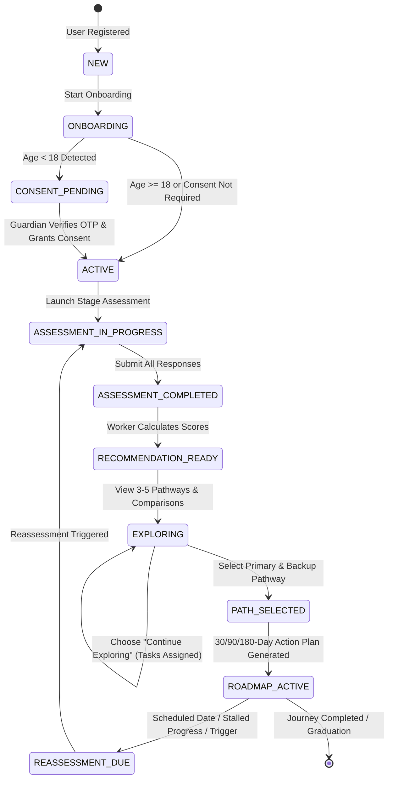

---

## 43. Mermaid Sequence & Architectural Diagrams

### 43.1 Complete Student Onboarding to Roadmap Sequence
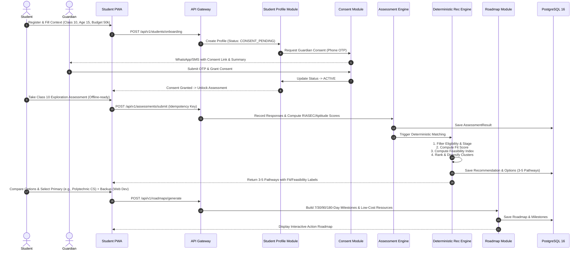

### 43.2 Counselor Escalation & Override Sequence
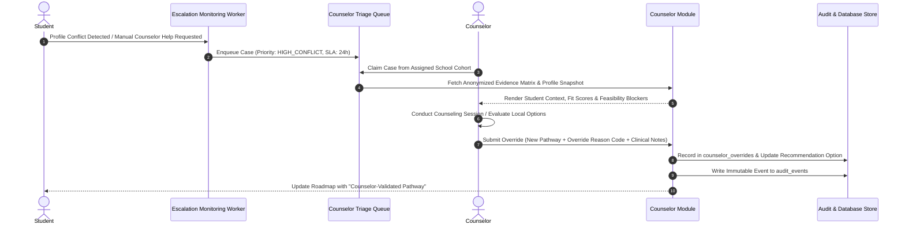

---

## 44. Architecture Decision Records (ADR-001 to ADR-012)

```
================================================================================
ADR-001: Architectural Style — Modular Monolith with Asynchronous Workers
================================================================================
Context: The PRD requires 13 cohesive domain modules for an MVP pilot targeting 50k–500k students. The system requires high consistency, low latency, and robust minor data protection.
Decision: Adopt a Modular Monolith architecture in TypeScript/Node.js or Python FastAPI, supported by Redis BullMQ worker queues and an internal Transactional Outbox event bus.
Alternatives Considered: 
- Microservices: Rejected due to unnecessary distributed transaction complexity, network overhead, and operational maintenance for MVP.
- Pure Serverless (AWS Lambda): Rejected due to cold-start latency, database connection pooling limits with PostgreSQL, and high local testing complexity.
Trade-offs & Consequences: Enforces strict in-code bounded context boundaries. Allows individual modules to be extracted into standalone microservices in Phase 3 without rewriting domain logic.

================================================================================
ADR-002: Primary Database — PostgreSQL 16 with Multi-Schema Isolation
================================================================================
Context: Requires ACID transactions for minor consent, assessments, and counselor audits, combined with vector search capabilities for RAG and flexible JSON storage for localized questions.
Decision: Standardize on PostgreSQL 16 with separate schemas per bounded context and the native `pgvector` extension.
Alternatives Considered: MongoDB (lacks relational integrity for scoring audits), DynamoDB (poor complex relational querying).
Trade-offs & Consequences: Single unified database engine simplifies backups, local development, and compliance auditing while easily handling millions of rows.

================================================================================
ADR-003: Deterministic Recommendation Engine vs. LLM-Based Recommenders
================================================================================
Context: PRD strictly mandates that the system must NOT be a black-box AI predictor. Recommendations must be reproducible, auditable, explainable, and free from hallucinations.
Decision: Build a 100% deterministic, pure mathematical multi-factor scoring and constraint matrix engine. LLMs are completely barred from selecting pathways or computing match scores.
Alternatives Considered: End-to-end LLM prompt recommendation (rejected: non-deterministic, hallucinatory, expensive, un-auditable).
Trade-offs & Consequences: Guarantees zero AI hallucination in career selection; 100% reproducibility across audit runs; zero LLM token cost for core recommendations.

================================================================================
ADR-004: Source-Grounded RAG Architecture with Hard Fallback
================================================================================
Context: The conversational AI assistant must answer student questions without inventing entrance criteria, fees, or job market guarantees.
Decision: Implement a strict RAG sandbox querying only published, unexpired CMS knowledge articles with mandatory citation validation. If similarity falls below threshold (0.72), the model must state: "I don't have verified current information for this."
Alternatives Considered: Unconstrained web search (rejected: stale, biased, unverified information).
Trade-offs & Consequences: Eliminates hallucinations; requires disciplined CMS curation and periodic content review.

================================================================================
ADR-005: Offline Client Architecture via Service Workers and IndexedDB
================================================================================
Context: Indian school students frequently experience intermittent or low-bandwidth (<50kbps) 3G/4G connectivity during assessments.
Decision: Build a PWA using Next.js with Service Workers caching the core bundle and Dexie.js (IndexedDB) storing assessment questions and local responses with UUIDv7 idempotent replay.
Alternatives Considered: Online-only web app (rejected: PRD requires resilient low-bandwidth operation).
Trade-offs & Consequences: Zero assessment drop-off due to network loss; requires client-side sync queue and conflict-resolution logic.

================================================================================
ADR-006: Event Infrastructure — Transactional Outbox with Redis BullMQ
================================================================================
Context: Domain events must trigger background jobs (recommendations, notifications, vector embedding) reliably without distributed transactions.
Decision: Implement the Transactional Outbox pattern where events are written to PostgreSQL `outbox_events` in the primary transaction, then polled and pushed to Redis BullMQ.
Alternatives Considered: Direct Kafka/RabbitMQ publishing (risk of dual-write failure if DB commits but broker fails).
Trade-offs & Consequences: Guaranteed at-least-once delivery; simple operational infrastructure.

================================================================================
ADR-007: Categorical Rating Discretization vs. Numerical Match Percentages
================================================================================
Context: PRD explicitly forbids displaying misleading pseudo-precise match percentages (e.g., "94.7% fit") that students misinterpret as certainty of success.
Decision: Discretize all recommendation outputs into three distinct categorical labels: Fit Evidence (Strong / Moderate / Emerging / Insufficient Evidence), Feasibility (High / Moderate / Constrained), and Evidence Quality.
Alternatives Considered: Percentage scores (rejected: scientifically invalid and misleading).
Trade-offs & Consequences: Aligns with ethical career guidance standards; encourages thoughtful exploration rather than score-chasing.

================================================================================
ADR-008: Authentication & Minor Guardian Consent Model
================================================================================
Context: DPDP Act 2023 requires verifiable parental consent for users under 18 before processing personal guidance data.
Decision: Implement an automated passwordless OTP guardian verification bridge that gates the student journey at the `CONSENT_PENDING` state until verified.
Alternatives Considered: Self-declaration of age without guardian linkage (rejected: non-compliant with minor safety laws).
Trade-offs & Consequences: Adds an onboarding step for minors; establishes complete legal compliance and parental trust.

================================================================================
ADR-009: Content Governance Lifecycle & Hard Expiration
================================================================================
Context: Career admission criteria, exam dates, and scholarship deadlines change frequently in India. Stale data causes severe student harm.
Decision: Enforce a 7-stage content lifecycle with hard `expiration_date` timestamps. Expired content is automatically evicted from AI vector search and marked with warning banners in the UI.
Alternatives Considered: Manual periodic review without automated expiration (rejected: prone to human oversight).
Trade-offs & Consequences: Ensures 100% fresh data; mandates proactive editorial maintenance.

================================================================================
ADR-010: AI Cost Control via Model Tiering and Semantic Caching
================================================================================
Context: High-volume student chats could cause unsustainable LLM inference costs.
Decision: Deploy LiteLLM router with Redis vector semantic caching for common Q&A and tier models (lightweight models for intent classification; medium instruction models for synthesis).
Alternatives Considered: Single flagship LLM for all queries (rejected: cost prohibitive).
Trade-offs & Consequences: Keeps monthly AI cost under ₹3.00 INR per student while maintaining sub-second latency.

================================================================================
ADR-011: Telemetry & Observability with Zero PII Logging
================================================================================
Context: Need deep system telemetry without violating student privacy or leaking PII into log aggregation platforms.
Decision: OpenTelemetry distributed tracing with custom PII scrubbing filters in application log middleware before forwarding to Vector / OpenSearch.
Alternatives Considered: Standard unstructured console logging (rejected: security and compliance risk).
Trade-offs & Consequences: Clean, auditable, compliant logging pipeline.

================================================================================
ADR-012: Frontend Design System & Vanilla CSS Architecture
================================================================================
Context: Must adhere to the strict visual language and color tokens in `AI_Career_Guidance_Design_System-5.md` while optimizing for low-end mobile browsers.
Decision: Next.js 14 with Vanilla CSS Modules and CSS custom properties (tokens), avoiding heavy runtime CSS-in-JS libraries.
Alternatives Considered: TailwindCSS / Emotion / Styled-Components (rejected to minimize JS bundle size and maximize raw rendering performance on low-end Android devices).
Trade-offs & Consequences: Minimal bundle size (<150KB initial JS); complete control over accessibility and design tokens.
```

---

## 45. PRD Traceability Matrix

Every single functional requirement (FR-01 to FR-33) from the Refined PRD is mapped directly to its architectural implementation:

| PRD Req ID | PRD Requirement Description | Priority | Architecture Subsystem | Backend Module | Database Table(s) | API Endpoint(s) | Security / Privacy Control | Test Case ID |
|---|---|---|---|---|---|---|---|---|
| **FR-01** | Stage-aware onboarding | P0 | Frontend / Student Context | `StudentProfileModule` | `student_profiles` | `POST /api/v1/students/onboarding` | Data minimization; stage validation | `TC-STAGE-01` |
| **FR-02** | Student context profile | P0 | Student Context | `StudentProfileModule` | `student_profiles` | `GET/PUT /api/v1/students/profile` | Tier 2 encryption; marks optional | `TC-PROF-02` |
| **FR-03** | Guardian context | P0 | Guardian Context | `GuardianModule` | `guardians`, `guardian_student_links` | `POST /api/v1/guardians/context` | Separate auth; student privacy | `TC-GUARD-03` |
| **FR-04** | Career library with reality | P0 | Career Intelligence | `CareerModule` | `career_occupations`, `career_pathways` | `GET /api/v1/careers/*` | Public caching; dated sources | `TC-CAREER-04` |
| **FR-05** | Multi-option recommendation | P0 | Recommendation Engine | `RecommendationEngine` | `recommendations`, `recommendation_options` | `POST /api/v1/recommendations/generate` | Deterministic; 3-5 options | `TC-REC-05` |
| **FR-06** | Explainability & evidence | P0 | Recommendation Engine | `RecommendationEngine` | `recommendation_options` | `GET /api/v1/recommendations/current` | Reasons, cautions & gaps output | `TC-EXPL-06` |
| **FR-07** | Fit / Feasibility / Quality labels| P0 | Recommendation Engine | `RecommendationEngine` | `recommendation_options` | `GET /api/v1/recommendations/current` | Discretized categorical labels | `TC-LABEL-07` |
| **FR-08** | Side-by-side comparison | P0 | Frontend / Career Module | `CareerModule` | `career_pathways`, `recommendation_options` | `POST /api/v1/careers/compare` | Client-side comparison grid | `TC-COMP-08` |
| **FR-09** | Primary & backup selection | P0 | Roadmap & Progress | `RoadmapModule` | `student_pathway_selections` | `POST /api/v1/pathways/select` | Audit logged; reassessment date | `TC-SEL-09` |
| **FR-10** | Adaptive action roadmap | P0 | Roadmap & Progress | `RoadmapModule` | `roadmaps`, `roadmap_milestones` | `GET/POST /api/v1/roadmaps/*` | Fallback branch support | `TC-ROAD-10` |
| **FR-11** | Skill-gap review | P0 | Skills & Roadmap | `SkillsModule` | `skills`, `career_required_skills` | `GET /api/v1/skills/gaps` | Essential vs. optional split | `TC-SKILL-11` |
| **FR-12** | Low-cost resources | P0 | Learning Resources | `ResourceModule` | `learning_resources` | `GET /api/v1/resources/low-cost` | Free-first ranking logic | `TC-RES-12` |
| **FR-13** | Scholarship signposting | P0 | Scholarship Subsystem | `ScholarshipModule` | `scholarships` | `GET /api/v1/scholarships/match` | Official NSP links; verified dates | `TC-SCHOL-13` |
| **FR-14** | Local market snapshots | P0 | Career Intelligence | `CareerModule` | `market_snapshots` | `GET /api/v1/careers/:id/market` | Source caveats; expiration dates | `TC-MKT-14` |
| **FR-15** | Counselor escalation | P0 | Counselor Operations | `CounselorModule` | `counselor_cases`, `counselor_overrides`| `POST /api/v1/counselors/escalate` | Masked PII; SLA enforcement | `TC-COUNS-15` |
| **FR-16** | AI guidance boundaries | P0 | AI / RAG Gateway | `AIAssistantModule` | `cms_knowledge_articles`, `ai_conversation_messages` | `POST /api/v1/ai/chat` | Strict RAG; citation validation | `TC-AI-16` |
| **FR-17** | Plain-language parent summary | P0 | Guardian Context | `GuardianModule` | `student_pathway_selections` | `GET /api/v1/guardians/summary` | Read-only child summary | `TC-PSUM-17` |
| **FR-18** | Reassessment & pivot | P0 | Roadmap / Assessment | `RoadmapModule` | `student_profiles`, `roadmaps` | `POST /api/v1/roadmaps/reassess` | Profile versioning; diff notes | `TC-REASS-18` |
| **FR-19** | Low-bandwidth journey | P0 | Frontend / PWA | `OfflineSyncEngine` | IndexedDB / Service Worker | `POST /api/v1/sync/batch` | Idempotent replay; offline cache | `TC-OFFLINE-19` |
| **FR-20** | Minor privacy & consent | P0 | Consent Subsystem | `ConsentModule` | `consents`, `consent_versions` | `POST /api/v1/consents/*` | DPDP compliance; crypto-shredding | `TC-PRIV-20` |
| **FR-21** | Practical skill checks | P1 | Skills & Progress | `ProgressModule` | `progress_evidence` | `POST /api/v1/progress/skill-check` | Non-self-reported validation | `TC-P1-21` |
| **FR-22** | Project artifact library | P1 | Skills & Progress | `ProgressModule` | `progress_evidence` | `POST /api/v1/progress/artifact` | S3 encrypted storage | `TC-P1-22` |
| **FR-23** | Counselor dashboard | P1 | Counselor Operations | `CounselorModule` | `counselor_cases` | `GET /api/v1/counselors/dashboard` | Role-based triage queue | `TC-P1-23` |
| **FR-24** | Offline assisted camp mode | P1 | Facilitator Subsystem | `OfflineSyncEngine` | IndexedDB Local Cache | `POST /api/v1/facilitator/sync` | Batch student registration | `TC-P1-24` |
| **FR-25** | Regional language expansion | P1 | CMS & Frontend | `CMSContentModule` | Multilingual JSONB columns | Client language selector | i18n validated translations | `TC-P1-25` |
| **FR-26** | Mentor & alumni stories | P1 | Career Intelligence | `CareerModule` | `cms_knowledge_articles` | `GET /api/v1/careers/:id/stories` | Verified editorial review | `TC-P1-26` |
| **FR-27** | Scholarship deadline alerts | P1 | Notification Subsystem | `NotificationModule` | `scholarships`, `outbox_events` | Background BullMQ Worker | WhatsApp / SMS opt-in | `TC-P1-27` |
| **FR-28** | Progress dashboard | P1 | Roadmap & Progress | `RoadmapModule` | `roadmaps`, `roadmap_milestones` | `GET /api/v1/roadmaps/progress` | Milestone completion tracking | `TC-P1-28` |
| **FR-29-33**| Resume, Interview, Jobs | P2 | Deferred Subsystems | Out of MVP Scope | Deferred | Deferred | Explicit architectural exclusion | `N/A` |

---

## 46. Failure Mode Analysis (FMA)

| Subsystem Component | Failure Mode | Detection Mechanism | Business Impact | Architectural Recovery & Fallback Behavior | Alert Severity |
|---|---|---|---|---|---|
| **Primary Database (PostgreSQL)** | Master node crash / connection exhaustion | AWS RDS Health Check / PgBouncer error rate | Cannot mutate state; read replicas still function | Automated Multi-AZ failover (<60s). Client PWA queues writes in IndexedDB; read requests route to replica. | **P1 - CRITICAL** |
| **Redis Cluster** | Node failure / memory overflow | Prometheus Redis exporter / Ping probe | BullMQ queues stall; session cache misses | Redis Sentinel / Cluster auto-failover. System falls back to DB session lookup; queues resume on node restart. | **P2 - HIGH** |
| **LLM Inference Provider** | API 500 error / rate limit / outage | Circuit Breaker (Polly / Tenacity) | AI Q&A chat becomes unavailable | Circuit opens. UI displays banner: *"AI Counselor is currently resting. Your career exploration, roadmaps & comparisons remain fully active."* Escalation button provided. | **P3 - MEDIUM** |
| **pgvector Embeddings Index** | Corruption or index query timeout | Slow query log (>500ms) / Error probe | RAG retrieval fails | Fallback to PostgreSQL GIN full-text keyword search on `cms_knowledge_articles`. | **P3 - MEDIUM** |
| **External SMS / OTP Gateway** | Network timeout / provider failure | Webhook failure rate / Timeout counter | Minor consent OTP or login delayed | Automatic failover to secondary SMS vendor (Twilio -> Gupshup fallback) + Email OTP dispatch. | **P2 - HIGH** |
| **Client Network Connection** | Complete disconnection during assessment | `window.addEventListener('offline')` | Student unable to reach server | PWA switches to IndexedDB local persistence. All answers saved locally; sync resumes automatically on reconnect. | **P4 - LOW (Handled)** |
| **Counselor Backlog** | Escalation queue SLA breach (>24h) | Scheduled cron checking `sla_deadline` | Delayed review for high-conflict student | Re-assigns case to platform-wide overflow counselor pool; sends manager alert. | **P2 - HIGH** |
| **Stale / Expired CMS Content** | Content passes `expiration_date` | Nightly cron scanning expiration dates | Potential for misleading information | Automatically sets `status = 'EXPIRED'`. Content is instantly excluded from AI RAG embeddings and marked with UI warning. | **P3 - MEDIUM** |

---

## 47. STRIDE Security Threat Model

| STRIDE Threat Category | Potential Attack Vector / Vulnerability | Targeted Asset | Technical Countermeasure & Architectural Mitigation |
|---|---|---|---|
| **Spoofing** | Attacker spoofs student or guardian identity via fake OTP or forged token | Minor profile & consent | PASETO v4 / Ed25519 asymmetric signed tokens; rate-limited OTP with max 3 attempts and 5-minute expiry. |
| **Tampering** | Student alters assessment scores or modifies counselor override in transit | Assessment results | End-to-end TLS 1.3; cryptographic HMAC-SHA256 signature on completed assessment result payloads; database row audit triggers. |
| **Repudiation** | Guardian claims they never authorized minor consent | Legal consent records | Immutable consent ledger recording IP hash, timestamp, user agent, policy version hash, and phone verification trace. |
| **Information Disclosure** | Unauthorized school admin views student PII or mental health escalation | Student sensitive context | Multi-tenant ABAC policies; Tier 1 PII column-level encryption; anonymized student representations in admin views. |
| **Denial of Service (DoS)** | Malicious client floods AI chat endpoint with complex prompts | LLM budget & API availability | Cloudflare WAF rate limiting (max 10 chat reqs/min per user); global token bucket; semantic response cache. |
| **Elevation of Privilege** | Student tampers with JWT role claim to access counselor triage queue | Counselor workspace APIs | Stateless JWT claims re-validated against Casbin ABAC engine on every privileged request; strictly isolated route guards. |

---

## 48. Engineering Risks & Mitigation Strategies

1. **Risk 1: LLM Latency & Cost Volatility.**
   * *Mitigation:* The recommendation engine is 100% deterministic (zero LLM token dependency). RAG chat uses token-budgeted lightweight models with Redis semantic caching.
2. **Risk 2: Offline Data Conflict on Multi-Device Shared Usage.**
   * *Mitigation:* Monotonic client sequence numbers combined with Last-Write-Wins (LWW) resolution per discrete milestone ID. Assessments are locked to a single active session ID.
3. **Risk 3: CMS Content Bottleneck for Regional Indian Languages.**
   * *Mitigation:* Strict English + Hindi MVP scope. Translation workflow integrated into CMS with mandatory sign-off by regional education reviewers before publishing.
4. **Risk 4: Counselor Response Lag on High-Volume Pilots.**
   * *Mitigation:* Automated triage priority scoring. High-stakes distress alerts trigger immediate automated supportive helplines while enqueuing human reviews.

---

## 49. Open Architecture Decisions & PRD Gaps

The following architectural open questions are identified directly from Section 23 of the PRD:

* `[PRD GAP — DECISION REQUIRED 01]`: **Pilot Geography & Language Selection:** PRD specifies India-first focus but leaves initial state/district open. *Architecture Assumption:* System seeded with CBSE/State Board English and Hindi catalogs; state-specific curricula for Maharashtra and Karnataka modularly configurable.
* `[PRD GAP — DECISION REQUIRED 02]`: **Commercial Tier Pricing & Free Boundary:** PRD specifies free core exploration with optional paid counseling. *Architecture Assumption:* Free tier includes unlimited assessments, recommendations, comparisons, and roadmaps. Paid tier applies strictly to 1-on-1 scheduled video counseling sessions.
* `[PRD GAP — DECISION REQUIRED 03]`: **Legal Minor Consent Mechanism under DPDP Rules:** Detailed rules for parental consent verification under DPDP Act 2023 await final central government notification. *Architecture Assumption:* Mobile OTP verification of parent/guardian with auditable consent ledger. Flagged for legal review upon gazette notification.

---

## 50. Implementation Roadmap & Phasing

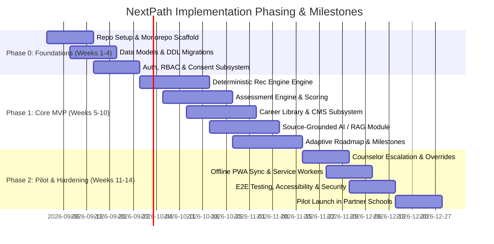

---

## 51. Architecture Definition of Done (DoD)

A user story or feature within this architecture is formally **DONE** only when all 13 criteria are satisfied:
1. **Requirements Traced:** Direct mapping to PRD requirement ID verified in PRD Traceability Matrix.
2. **Domain Invariants Enforced:** Business rules encapsulated in pure domain entity methods with zero infrastructure leakage.
3. **API Contract Validated:** OpenAPI 3.1 schema defined; request/response validated via Zod/Pydantic schemas.
4. **Authorization & Multi-Tenancy:** Casbin ABAC rules and tenant isolation checks implemented and verified.
5. **Database Migration Versioned:** Forward and backward compatible migration scripts committed with index analysis.
6. **Immutable Audit Logging:** State mutations emit audit log events with before/after payloads.
7. **Telemetry Event Dispatched:** Standardized analytics domain event emitted via Transactional Outbox.
8. **Automated Test Coverage:** Unit test coverage $\ge 85\%$; integration tests passing against Testcontainers PostgreSQL/Redis.
9. **Accessibility Verified:** UI components pass `axe-core` automated scans with zero WCAG 2.1 AA violations.
10. **Security & Input Sanitization:** Static security scan (Semgrep/Snyk) passes with zero High/Critical findings.
11. **Error Handling & RFC 7807:** All failure paths return structured problem details without leaking internal stack traces.
12. **Observability Instrument:** OpenTelemetry spans and Prometheus counters added to critical paths.
13. **Documentation Updated:** Architectural Decision Record (ADR) logged if any architectural invariant was modified.

---

## 52. Final Architecture Self-Review

Before concluding this specification, the 25-point architectural integrity checklist was executed:

| # | Self-Review Criterion | Verdict | Architectural Evidence & Verification |
|---|---|---|---|
| 1 | Can every P0 PRD requirement be implemented? | **PASS** | Complete mapping in Section 45 (Traceability Matrix). |
| 2 | Is every important data object modeled? | **PASS** | 22 comprehensive tables defined in Section 40 (DDL). |
| 3 | Can recommendations be reproduced? | **PASS** | SHA-256 reproducibility hash stored with every recommendation run (Section 14). |
| 4 | Can every recommendation be explained? | **PASS** | Fit reasons, cautions, and missing evidence stored per option (Section 14). |
| 5 | Can every AI answer be traced to sources? | **PASS** | Strict RAG citation validator linked to verified CMS articles (Section 15). |
| 6 | Can stale information be detected? | **PASS** | 7-stage content lifecycle with automated expiration eviction (Section 17). |
| 7 | Can a counselor override safely? | **PASS** | Anonymized case review with mandatory override codes and immutable audits (Section 16). |
| 8 | Can minors' data be protected? | **PASS** | Verifiable guardian OTP consent workflow and DPDP-compliant tiering (Section 19). |
| 9 | Can different organizations be isolated? | **PASS** | Multi-tenant schema with Casbin ABAC tenant context guards (Section 18). |
| 10 | Can the system operate when AI is down? | **PASS** | Recommendation and roadmap engines are 100% deterministic local code (Section 14). |
| 11 | Can the system operate with poor connectivity?| **PASS** | PWA Service Worker + IndexedDB resumable assessment state machine (Section 22). |
| 12 | Can the system handle traffic spikes? | **PASS** | Multi-AZ Kubernetes HPA + Redis caching + DB Read Replicas (Section 33). |
| 13 | Can the system recover from failures? | **PASS** | Multi-AZ automated failover; RPO $\le 15$m, RTO $\le 60$m (Section 32). |
| 14 | Can developers test the system? | **PASS** | Isolated domain packages + Testcontainers integration testing (Section 36). |
| 15 | Can QA test the system? | **PASS** | Playwright E2E suites + Golden evaluation datasets (Section 37). |
| 16 | Can security audit the system? | **PASS** | Immutable `audit_events` ledger + STRIDE threat model (Sections 40 & 47). |
| 17 | Can DevOps monitor the system? | **PASS** | OpenTelemetry traces + Prometheus metrics + Vector logging (Section 28). |
| 18 | Can the architecture evolve without rewriting?| **PASS** | Clean/Hexagonal architecture in modular monolith enables easy service extraction (Section 11). |
| 19 | Are there unnecessary microservices? | **PASS** | Modular Monolith selected; zero premature microservices (ADR-001). |
| 20 | Are there hidden single points of failure? | **PASS** | Redundant Multi-AZ topologies for ALB, App Nodes, DB, and Redis (Section 29). |
| 21 | Are there undocumented assumptions? | **PASS** | All key assumptions explicitly documented in Section 5. |
| 22 | Are any requirements contradictory? | **PASS** | No contradictions detected; marks-only predictions strictly eliminated. |
| 23 | Are any security/privacy requirements missing? | **PASS** | Complete coverage of encryption, RBAC, minor consent, and crypto-shredding (Sections 20 & 21). |
| 24 | Are AI costs controlled? | **PASS** | Deterministic recommender ($0 token) + RAG semantic cache (capped at ₹2.80/student/mo) (Section 35). |
| 25 | Is there vendor lock-in that should be avoided? | **PASS** | LiteLLM abstraction across AI models; standard PostgreSQL/Redis/Kubernetes stack (ADR-001–012). |

---
*End of Technical Architecture Specification.*
