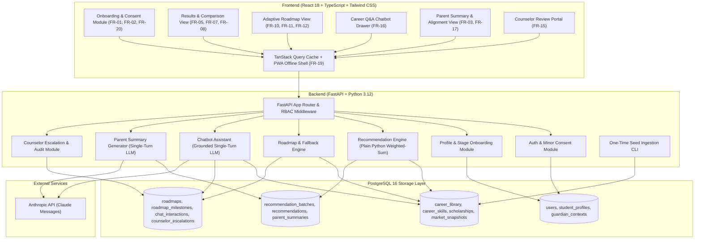

# System Architecture: Component Structure & Boundaries

## AI-Based Career Decision & Pathway Companion

**Document type:** Architecture shard — `docs/architecture/components.md`  
**Status:** Approved Architectural Baseline  
**Source of truth:** `docs/Refined_PRD_AI_Career_Guidance.md` (Refined PRD v2.0)  
**Design system source:** `docs/AI_Career_Guidance_Design_System-6.md` (Design System v6)  
**Companion shards:** 
- `docs/architecture/tech-stack.md`
- `docs/architecture/data-models.md`
- `docs/architecture/core-workflows.md`
- `docs/architecture/source-tree.md`

---

## 1. Architectural Component Map

The system is partitioned into two major layers: a client-side **React 18 / TypeScript SPA** (Progressive Web App) and a modular **FastAPI / Python 3.12 Backend**.

---

## 2. Backend Module Boundaries & Responsibilities

### 2.1 Authentication & Minor Consent (`backend.modules.auth`)
- **Responsibilities:**
  - Issue and verify stateless JWT tokens using `python-jose` and password hashing with `passlib[bcrypt]`.
  - Enforce Role-Based Access Control (RBAC): `student`, `guardian`, `counselor`, `admin`.
  - Validate and record minor consent (`consent_type`, `consent_given_by`, `consent_recorded_at`) per FR-20. Class 8–10 and 11–12 students require an active linked guardian account before onboarding finalization.

### 2.2 Profile & Stage-Aware Onboarding (`backend.modules.profile`)
- **Responsibilities:**
  - Validate education-stage branching (`class_8_10`, `class_11_12`, `early_college`) per FR-01.
  - Store interests, non-mandatory aptitude signals, budget tiers, and relocation boundaries per FR-02.
  - Ingest guardian context and priorities separately to calculate alignment metrics per FR-03.
  - Calculate `profile_completeness_pct` and evidence flags.

### 2.3 Recommendation Engine (`backend.modules.recommendations`)
- **Responsibilities:**
  - Execute deterministic, transparent weighted-sum scoring (see `core-workflows.md`) across `career_library` records without machine learning or vector search (FR-05, FR-06).
  - Compute separate metric scores and labels: **Fit Evidence** (`Strong`/`Moderate`/`Emerging`), **Practical Feasibility** (`High`/`Moderate`/`Challenging`/`Low`), and **Evidence Quality** (`High`/`Moderate`/`Preliminary`/`Sparse`) per FR-07.
  - Formulate itemized `reasons`, practical `concerns`, and `missing_evidence_flags`.
  - Wrap outputs in a `RecommendationBatch` to preserve historical integrity on reassessment (FR-18).

### 2.4 Adaptive Roadmap Engine (`backend.modules.roadmap`)
- **Responsibilities:**
  - Generate initial 30/90/180-day execution milestones for selected primary and backup careers (FR-10).
  - Match skills to curated free/public resources (NPTEL, Swayam, Khan Academy) per FR-12.
  - Signpost active scholarships matching student qualifications, income ceiling, and category per FR-13.
  - Provide deterministic fallback actions for every milestone to prevent student deadlock.
  - Handle milestone completion verification (`self_report`, `quiz_score`, `project_artifact`).

### 2.5 Grounded Chatbot Assistant (`backend.modules.chatbot`)
- **Responsibilities:**
  - Intercept student career questions (FR-16).
  - Perform SQL lookup on `career_library` records matching query keywords and inject raw structured records into the prompt context.
  - Invoke single-turn Anthropic API (`claude-3-5-sonnet` / current stable model) with strict negative grounding system prompt ("Answer only from the provided career data; if unmentioned, state that information is unavailable").
  - Log complete question, injected career IDs, and answer text in `chat_interactions` table for governance auditing.
  - Detect crisis keywords (e.g. self-harm, severe distress) and immediately stop advice, returning emergency helpline contacts and triggering counselor escalation (PRD Section 14).

### 2.6 Parent Summary Generator (`backend.modules.parent_summary`)
- **Responsibilities:**
  - Transform structured `RecommendationBatch` data into a plain-language guardian overview (FR-17).
  - Invoke single-turn Anthropic API call with deterministic template.
  - Persist output in `parent_summaries` table keyed to `recommendation_batch_id`.

### 2.7 Counselor Escalation & Review (`backend.modules.escalation`)
- **Responsibilities:**
  - Automatically evaluate escalation rules (student-guardian deadlock, low evidence, safety triggers) per FR-15 & PRD Section 14.
  - Provide triage endpoints for human counselors to review frozen profile snapshots (`student_summary_snapshot`).
  - Gracefully handle anonymized safety audit records where `student_id = NULL` (due to account deletion), rendering `[Anonymized / Closed Account]` without requiring active foreign profile joins.
  - Log counselor overrides with mandatory rationale (`counselor_override_rationale`).

### 2.8 Seed Ingestion Component (`backend.data.seed_runner`)
- **Responsibilities:**
  - Idempotent CLI script loading Scholar-Spot, Naukri, and O*NET seed datasets into PostgreSQL.
  - Applies title mapping lookup (`/data/seed/mappings/naukri_title_to_career_map.json`) and O*NET importance score normalization ($(\text{raw} - 1) / 4 \times 100$) with cutoff tiers.

---

## 3. Frontend Component Structure (Design System v6 Compliant)

All UI components are built in **TypeScript / React 18** using **Tailwind CSS 3.4** tokens specified in `docs/AI_Career_Guidance_Design_System-6.md`:
- **Canvas:** Paper-calm warm background (`bg-[#ffffff]` / `bg-[#f6f5f4]`).
- **Structural Accent:** Primary Blue (`#0075de`, active `#005bab`) for all CTAs and interactive focus states.
- **Decorative Accents:** AI Accent (`#391c57` / `#d6b6f6`), Success (`#1aae39`), Warning (`#dd5b00`), Sky (`#62aef0`), Teal (`#2a9d99`).
- **Typography:** Inter across all 11 standardized scale tiers.

### 3.1 Route & View Architecture

| Route Path | View Component | Core Features & Design System Components |
|---|---|---|
| `/onboarding` | `OnboardingWizard` | Multi-step stage-aware questionnaire (`React Hook Form` + `Zod`), minor consent dialog, progress indicator, budget selector. |
| `/results` | `ResultsDashboard` | 3–5 `CareerCard` shortlist, `MatchScoreBadge` with fit/feasibility/evidence indicators, filter by cluster, selection CTA. |
| `/careers/:career_id` | `CareerDetailView` | Deep-dive pathway view with localized Indian entry routes, exam prerequisites, fee ranges in INR, and market trends. |
| `/compare` | `CareerComparisonView` | Side-by-side comparison table (prerequisites, duration, cost range, market demand caveats) for 3 pathways (FR-08). |
| `/roadmap` | `RoadmapView` | Interactive `RoadmapTimeline` partitioned into 7-day, 30-day, 90-day, and 180-day buckets, skill gap checklist, scholarship drawer. |
| `/guardian` | `ParentSummaryView` | Read-only plain-language summary, cost transparency card, shared discussion guide, conflict flags (FR-17). |
| `/counselor` | `CounselorQueueView` | Counselor triage table, frozen student snapshot inspector, override & notes modal (FR-15). |
| `/settings` | `ProfileSettingsView` | Profile details, guardian context view/edit, language selector, consent audit record, and account deletion flow (FR-20). |

### 3.2 Key Reusable UI Components

1. **`MatchScoreBadge` (`components/ui/MatchScoreBadge.tsx`):**  
   Displays the transparent 3-label breakdown rather than a bare confidence percentage:
   - Fit badge (e.g. `Strong` in `#1aae39` or `Emerging` in `#dd5b00`).
   - Feasibility indicator (e.g. `High` / `Challenging`).
   - Evidence Quality meter (e.g. `High` / `Sparse`).
2. **`CareerCard` (`components/career/CareerCard.tsx`):**  
   Displays canonical title, localized entry routes, estimated cost range in INR, risks/trade-offs, and primary/backup toggle.
3. **`RoadmapTimeline` (`components/roadmap/RoadmapTimeline.tsx`):**  
   Vertical milestone sequence with milestone status icons, fallback action dropdowns, and free resource links.
4. **`ChatbotFAB & Drawer` (`components/chat/ChatbotDrawer.tsx`):**  
   Floating Action Button tagged with decorative AI Accent (`#391c57`), opening a slide-over panel for grounded career Q&A with clear source citations and disclaimer.
