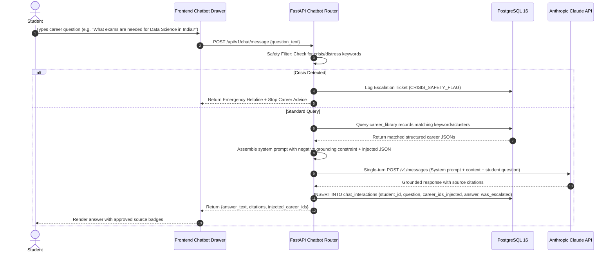
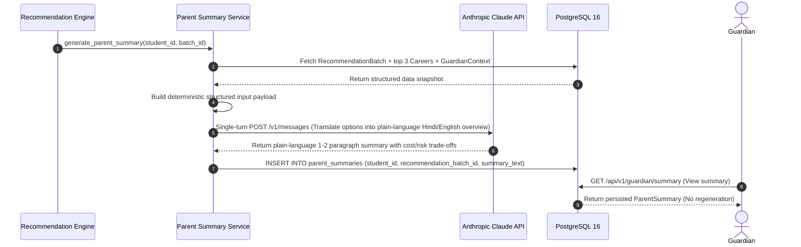
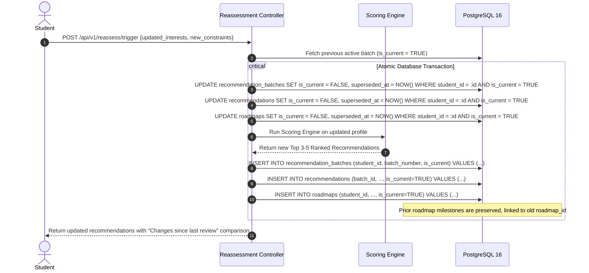

# System Architecture: Core Workflows & Logic

## AI-Based Career Decision & Pathway Companion

**Document type:** Architecture shard — `docs/architecture/core-workflows.md`  
**Status:** Approved Architectural Baseline  
**Source of truth:** `docs/Refined_PRD_AI_Career_Guidance.md` (Refined PRD v2.0)  
**Companion shards:** 
- `docs/architecture/tech-stack.md`
- `docs/architecture/data-models.md`
- `docs/architecture/database-schema.md`
- `docs/architecture/components.md`

---

## 1. Recommendation Engine Scoring Workflow (FR-05, FR-06, FR-07)

In strict accordance with the locked **Tech Stack**, the recommendation engine is implemented in **plain Python without machine learning frameworks or vector retrieval**. Every output score is an inspectable, auditable calculation that directly produces the 3-label breakdown required by PRD FR-07.

```mermaid
flowchart TD
    Profile[Student Profile + Constraints] --> FetchCatalog[Fetch Career Library Catalog]
    FetchCatalog --> LoopCareers[Iterate Over Career Entries]
    
    subgraph ScoringEngine ["Deterministic Scoring Engine (Plain Python)"]
        LoopCareers --> CalcFit[Calculate Fit Score: RIASEC + Aptitude Match]
        LoopCareers --> CalcFeas[Calculate Feasibility Score: Budget + Location + Stage]
        LoopCareers --> CalcEvid[Calculate Evidence Quality Score: Completeness]
        
        CalcFit & CalcFeas & CalcEvid --> CalcComposite[Composite Score = 0.55*Fit + 0.45*Feasibility - 0.10*(100-Evidence)]
        CalcComposite --> DeriveLabels[Derive Fit, Feasibility, & Evidence Labels]
        DeriveLabels --> GenerateExplain[Generate Reasons, Concerns, Missing Flags]
    end

    GenerateExplain --> RankTop[Rank & Select Top 3-5 Pathways]
    RankTop --> CreateBatch[Save to DB in new RecommendationBatch]
    CreateBatch --> TriggerParentSummary[Trigger Parent Summary Generator LLM Call]
```

### 1.1 Mathematical Formulation

For each career $c \in \text{CareerLibrary}$ against student profile $s \in \text{StudentProfile}$:

#### 1. Personal Fit Score ($\text{Fit}(s, c) \in [0, 100]$):
$$\text{Fit}(s, c) = 0.60 \cdot \text{RIASEC\_Alignment}(s, c) + 0.40 \cdot \text{Aptitude\_Signal\_Match}(s, c)$$
- $\text{RIASEC\_Alignment}(s, c)$: Dot-product similarity between normalized student interest vectors and career Holland scores.
- $\text{Aptitude\_Signal\_Match}(s, c)$: Overlap score between student-reported favorite subjects / self-reported strengths and the career's prerequisite knowledge domains.

#### 2. Practical Feasibility Score ($\text{Feas}(s, c) \in [0, 100]$):
$$\text{Feas}(s, c) = 0.45 \cdot \text{Budget\_Compatibility}(s, c) + 0.35 \cdot \text{Relocation\_Fit}(s, c) + 0.20 \cdot \text{Stage\_Eligibility}(s, c)$$
- $\text{Budget\_Compatibility}$: Evaluates if any Indian entry route for career $c$ falls within the family's `budget_tier` / `financial_ceiling_inr`. (100 if entry route cost $\le$ budget; penalized proportionally if cost exceeds budget unless high-value scholarships exist).
- $\text{Relocation\_Fit}$: 100 if education/jobs exist within `relocation_willingness`; 40 if career requires relocation beyond student's allowed boundary.
- $\text{Stage\_Eligibility}$: 100 if student's `education_stage` and stream satisfy career prerequisites; 50 if bridge/remedial courses are required.

#### 3. Evidence Quality Score ($\text{Evid}(s) \in [0, 100]$):
$$\text{Evid}(s) = 0.70 \cdot \text{profile\_completeness\_pct} + 0.30 \cdot (100 \text{ if } \text{academic\_records\_available} \text{ else } 40)$$

#### 4. Composite Score ($\text{Composite}(s, c) \in [0, 100]$):
$$\text{Composite}(s, c) = \max\Big(0.0, \, 0.55 \cdot \text{Fit}(s, c) + 0.45 \cdot \text{Feas}(s, c) - 0.10 \cdot (100 - \text{Evid}(s))\Big)$$

---

### 1.2 Categorical Label Assignment Rules (FR-07)

To prevent misinterpretation of bare numbers, scores map to standardized labels:

| Metric | Score Range | Label Assigned | Communicated Meaning |
|---|---|---|---|
| **Fit Evidence** | $\ge 75.0$ | **`Strong`** | High alignment across interests and stated strengths. |
| | $55.0 - 74.9$ | **`Moderate`** | Notable interest overlap; some skill areas unexplored. |
| | $35.0 - 54.9$ | **`Emerging`** | Nascent interest or partial subject alignment. |
| | $< 35.0$ | **`Insufficient evidence`** | Profile does not provide clear alignment signals. |
| **Feasibility** | $\ge 75.0$ | **`High`** | Direct low-cost entry routes exist locally. |
| | $50.0 - 74.9$ | **`Moderate`** | Realistic with moderate budget or standard exams. |
| | $30.0 - 49.9$ | **`Challenging`** | High cost, strict entrance filters, or relocation needed. |
| | $< 30.0$ | **`Low`** | Severe budget/prerequisite constraints identified. |
| **Evidence Quality** | $\ge 80.0$ | **`High`** | Full profile with academic records and validated signals. |
| | $50.0 - 79.9$ | **`Moderate`** | Standard questionnaire completed; records unverified. |
| | $30.0 - 49.9$ | **`Preliminary`** | Partial questionnaire answers; exploratory state. |
| | $< 30.0$ | **`Sparse`** | Critical constraint/interest fields missing. |

---

## 2. LLM Call #1: Grounded Career Q&A Chatbot Workflow (FR-16)



### System Prompt Template for Chatbot (Strict Boundary Enforcement):
```
You are the Career Information Assistant for Next_Path. You provide factual, encouraging, and transparent guidance to Indian students.

STRICT OPERATIONAL BOUNDARIES:
1. You may ONLY use the verified career records provided below inside <approved_career_context>.
2. If the user asks about an exam, cost, duration, or prerequisite NOT present in the approved context, you MUST state: "I do not have verified information on that in our current database. Please consult a school counselor or official portal."
3. NEVER guarantee job placement, admissions, or future salary outcomes.
4. Always highlight low-cost or public alternative routes where available in the context.

<approved_career_context>
{injected_career_json_data}
</approved_career_context>
```

---

## 3. LLM Call #2: Parent Summary Generation Workflow (FR-17)



---

## 4. Reassessment & Historical Preservation Workflow (FR-18)

When a student updates their profile or completes a scheduled review:



---

## 5. Seed Data Ingestion & Transformation Workflow

```mermaid
flowchart TD
    Start([Execute `python -m backend.data.seed_db`]) --> ReadNaukri[Read Naukri Job Postings CSV]
    ReadNaukri --> LoadNaukriMap[Load /data/seed/mappings/naukri_title_to_career_map.json]
    LoadNaukriMap --> MatchTitles{Is Title in Lookup Map?}
    MatchTitles -- Yes --> AggregateNaukri[Aggregate Skills Frequency & Salary Bands by career_id]
    MatchTitles -- No --> LogUnmapped[Log to unmapped_titles.log for SME Review]
    AggregateNaukri --> InsertMarket[Insert into market_snapshots table]

    Start --> ReadONet[Read O*NET v30.3 essential_skills.csv]
    ReadONet --> NormScores[Normalize Scores: norm = (raw - 1.0) / 4.0 * 100]
    NormScores --> ApplyTiers[Assign Category: >=70 Essential, 50-69 Useful, <50 Optional]
    ApplyTiers --> LoadONetOverrides[Apply /data/seed/mappings/onet_skill_tier_overrides.json]
    LoadONetOverrides --> InsertSkills[Insert into career_skills table]

    Start --> ReadScholarships[Read Scholar-Spot CSV]
    ReadScholarships --> CleanScholarships[Strip header spaces, map LINKS to official_source_url, add governance dates]
    CleanScholarships --> InsertScholarships[Insert into scholarships table]
```
