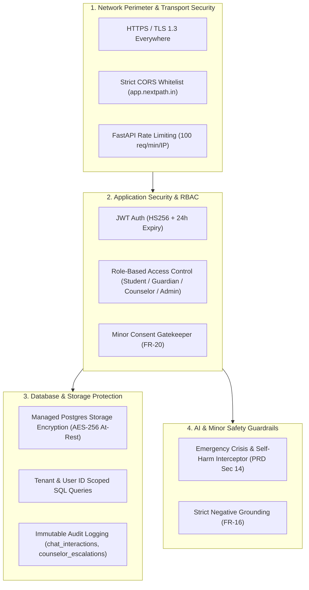

# System Architecture: Security, Privacy & Minor Governance

## AI-Based Career Decision & Pathway Companion

**Document type:** Architecture shard — `docs/architecture/security-and-privacy.md`  
**Status:** Approved Architectural Baseline  
**Source of truth:** `docs/Refined_PRD_AI_Career_Guidance.md` (Refined PRD v2.0 - Sections 13, 14, 16 & FR-20)  
**Design system source:** `docs/AI_Career_Guidance_Design_System-6.md`  
**Companion shards:** 
- `docs/architecture/tech-stack.md`
- `docs/architecture/data-models.md`
- `docs/architecture/database-schema.md`
- `docs/architecture/components.md`

---

## 1. Security Architecture Baseline

In alignment with **Invariant #5** (reconciled in `introduction.md` and locked in `tech-stack.md`), security at pilot scale is implemented via defense-in-depth across transport, managed storage, and application RBAC without introducing unpinned cryptographic libraries or speculative column-level cipher complexity.

---

## 2. Minor Consent & Privacy Architecture (FR-20, PRD Section 16)

Because the majority of users in Class 8–10 and Class 11–12 are minors under 18 years old, the platform adheres strictly to child data protection principles (India Digital Personal Data Protection Act baseline):

### 2.1 Mandatory Guardian Consent Gate
1. **Verification Requirement:** No student account enrolled in `class_8_10` or `class_11_12` can finalize their profile or trigger recommendations without verified guardian consent (`consent_type = 'guardian_consent_minor'`).
2. **Audit Record:** The `student_profiles` table immutably captures `consent_given_by` (FK to guardian `users.id`) and `consent_recorded_at` (timestamp).
3. **Adult Exemption:** Early college students aged 18+ may self-consent via `consent_type = 'self_consent_adult'`.

### 2.2 Data Minimization & Segregation
- **Academic Marks:** Strictly optional (FR-02). System functions fully using self-reported interests and strengths.
- **Sensitive Demographics:** Category (SC/ST/OBC/EBC) and annual income are captured solely for scholarship eligibility matching (FR-13), never for recommendation profiling or marketing.
- **No Commercial Data Brokerage:** Student data is never sold, shared with advertisers, or used for college recruitment commissions (PRD Section 18.4).

---

## 3. Role-Based Access Control (RBAC) Matrix

| Resource / Endpoint | Student | Guardian | Counselor | Admin |
|---|---|---|---|---|
| `/api/v1/profile` | Read / Write (Own) | Read-Only (Child) | Read (Assigned) | Read / Write |
| `/api/v1/profile/guardian` | Read-Only (Child view) | Read / Write (Own) | Read (Assigned) | Read / Write |
| `/api/v1/recommendations/*` | Read (Own active) | Read (Child active) | Read / Evaluate | Read / Write |
| `/api/v1/guardian/summary` | Read | Read (Child summary) | Read | Read |
| `/api/v1/counselor/queue` | ❌ Forbidden | ❌ Forbidden | Read / Review | Full Access |
| `/api/v1/counselor/review/*` | ❌ Forbidden | ❌ Forbidden | Read / Write Override | Full Access |
| `/api/v1/chat/message` | Read / Write (Own) | ❌ Forbidden | ❌ Forbidden | Audit Read |

---

## 4. AI Trust, Safety & Crisis Intervention Protocol (FR-16, PRD Section 14)

### 4.1 Grounding & Hallucination Prevention
1. **Strict Context Injection:** Chatbot responses are strictly constrained to verified database records injected into the system prompt context.
2. **Negative Constraint:** If a requested detail (e.g. college fees, cutoffs) is not in the injected context, the assistant is programmatically instructed to state that information is unavailable rather than fabricate an answer.
3. **Full Conversation Logging:** Every Q&A interaction is stored in `chat_interactions` with `career_ids_injected` to ensure full retrospective auditability.

### 4.2 Emergency Crisis & Self-Harm Safety Circuit (PRD Section 14, Line 563)
If a student message contains indicators of extreme distress, depression, or self-harm:
1. **Immediate Advice Halt:** Career guidance is instantly suspended.
2. **Safe Response:** The system immediately outputs an empathetic supportive message and displays national emergency and crisis helpline contacts (e.g. Tele-MANAS, KIRAN 1800-599-0019).
3. **Automated Counselor Escalation:** A high-priority ticket with `trigger_reason = 'crisis_safety_flag'` is automatically generated in `counselor_escalations`.

---

## 5. Data Rights, Erasure & Safety Audit Retention Exception (FR-20, PRD Section 14)

### 5.1 Standard Erasure Workflow
Upon formal account deletion request by a student or guardian:
- Personal profile data (`student_profiles`), guardian inputs (`guardian_contexts`), roadmaps, recommendations, and standard (non-escalated) chat logs are permanently deleted via cascading SQL deletion.

### 5.2 Mandatory Safety Audit Retention Exception (Issue 1 Resolution)
In accordance with child safety compliance, duty-of-care obligations, and PRD Section 14:
1. **Protected Records:** 
   - `counselor_escalations` rows where `trigger_reason = 'crisis_safety_flag'`
   - `chat_interactions` rows where `was_escalated = TRUE`
2. **Anonymization / Tombstoning Mechanism:**
   - These specific safety rows **MUST NOT be deleted**.
   - Instead, the application deletion service sets `student_id = NULL` (supported by database foreign key `ON DELETE SET NULL`), scrubs any identifying personal information (names, emails, phone numbers) from `student_summary_snapshot`, and retains the anonymized incident timestamp, question text, safety response, and counselor action.
3. **Audit Value:** Preserves mandatory legal proof that the platform executed proper emergency escalation protocols without retaining any identifiable minor personal data after account closure.
